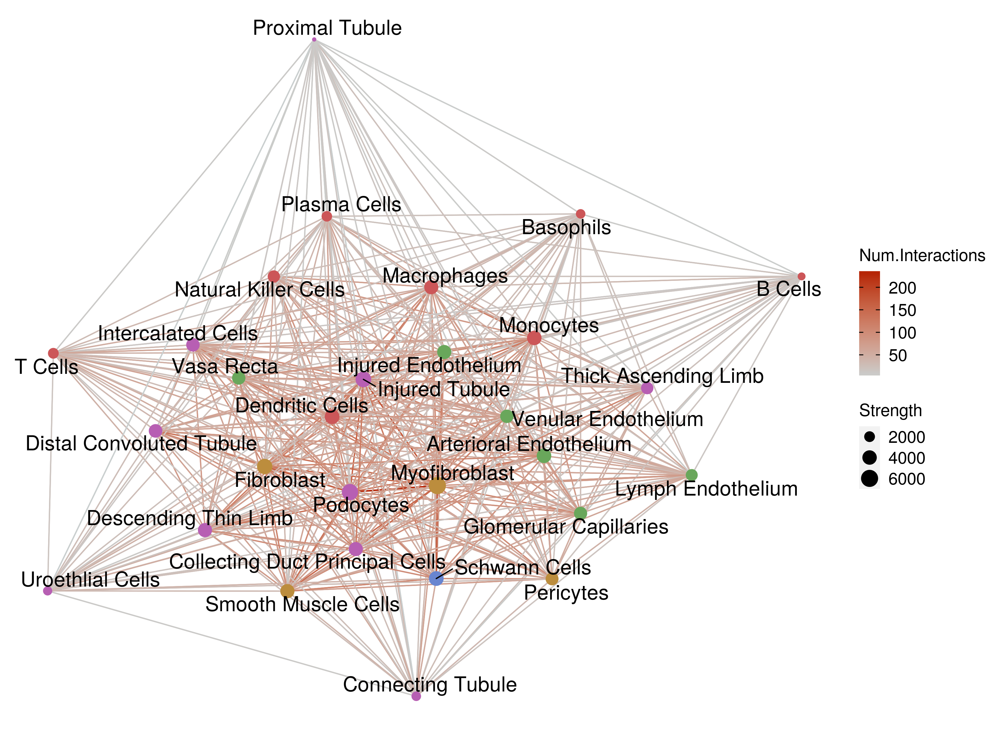
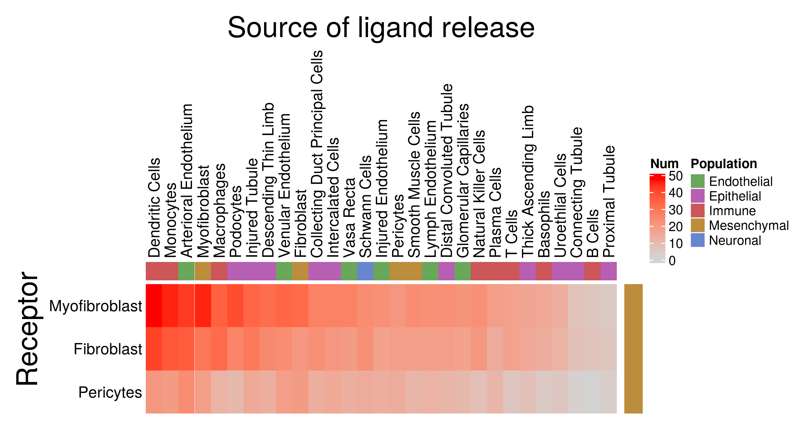
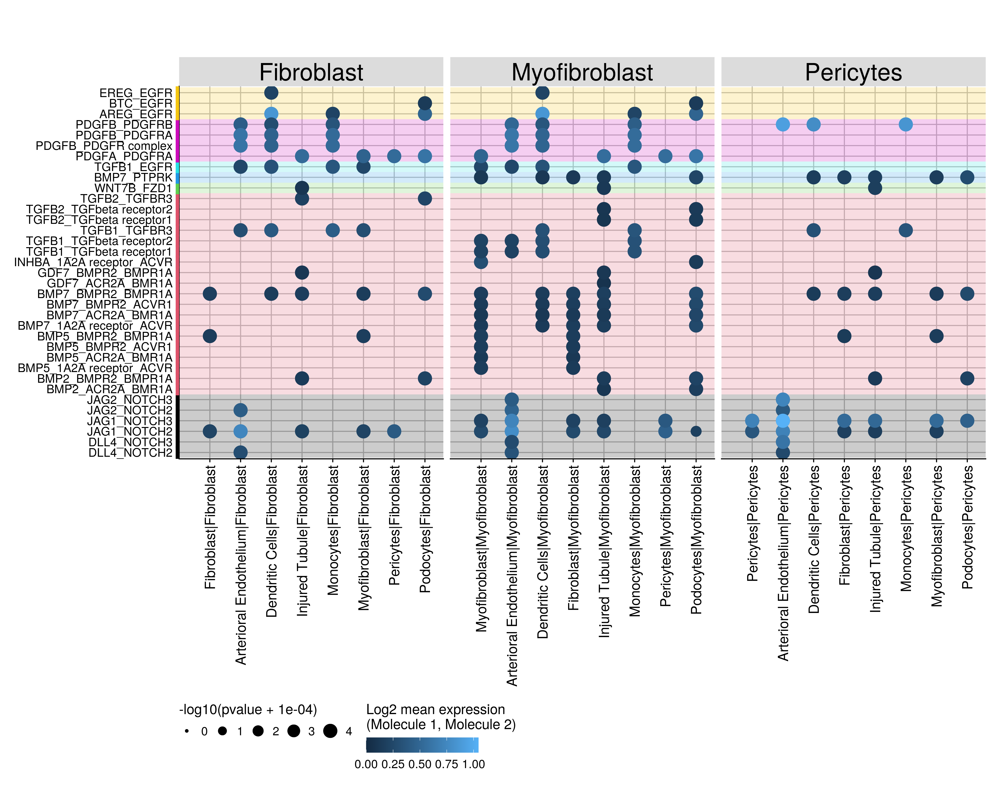

Cell-Cell ligand-receptor interactions in kidney (CD10- fraction)
================
Javier Perales-Patón - <javier.perales@bioquant.uni-heidelberg.de> -
ORCID: 0000-0003-0780-6683

## Setup environment

### File output structure

``` r
options(stringsAsFactors = FALSE)
# Seed number
set.seed(1234)
# Directory of CellPhoneDB databases
CPDB_DIR <- "~/.cpdb/releases/v2.0.0/"
# Output directory
OUTDIR <- "./CD10negative_03_ligand-receptor_output/"
if(!dir.exists(OUTDIR)) dir.create(OUTDIR);

# Figures
FIGDIR <- paste0(OUTDIR, "/figures/")
knitr::opts_chunk$set(fig.path=FIGDIR)
knitr::opts_chunk$set(dev=c('png', 'pdf'))
# Data
DATADIR <- paste0(OUTDIR, "/data/")
if(!dir.exists(DATADIR)) dir.create(DATADIR);

# If already exists, clean dirs?
clean_dirs <- TRUE
if(clean_dirs) {
    unlink(list.files(OUTDIR, full.names=TRUE, recursive = TRUE))
}
```

### Load libraries

``` r
# Please change it to your local installation of CellPhoneDB
CPDB_DIR <- "~/.cpdb/releases/v2.0.0/"
### Libraries ####
library(ggplot2)
library(ggraph)
suppressPackageStartupMessages(library(igraph))
suppressPackageStartupMessages(library(ComplexHeatmap))
suppressPackageStartupMessages(library(GSEABase))
```

## Load data

We first define the input data files and do sanity check

``` r
# Metadata for cell populations for the dataset
meta_fl <- "../data/CD10negative/kidneyMap_UMI_counts_colData.txt"
# 'out' output director from CPBP 
CPDB_out <- "./CD10negative_02_CPDB_output/lvl2/out/"
# Sanity check
if(!file.exists(meta_fl)) {
    stop(paste0("The metadata file does not exist at '",
            meta_fl,"'\n"))
}

if(dir.exists(CPDB_out)) {
    pval_fl <- paste0(CPDB_out,"/pvalues.txt")
    means_fl <- paste0(CPDB_out,"/means.txt")
    pavg_fl <- paste0(CPDB_out,"/significant_means.txt")

    CPDB_outs <- c("pval_fl", "means_fl", "pavg_fl")
    for(fl in CPDB_outs) {
        if(!file.exists(get(fl))) {
            stop(paste0("The input file '",fl,"' does not exist at ",
                    "'",get(fl),"'\n"))
        }
    }
    
} else {
    stop("The directory output of CellPhoneDB does not exist\n")
}
```

Read the CellPhoneDB’s output with human CD10- kidney cells

``` r
#### Data #####
#--- group annotation
meta <- read.table(meta_fl, sep="\t", header=TRUE, stringsAsFactors = FALSE)
meta12 <- unique(meta[,1:2])

ann2_t_1 <- data.frame("Population"=meta12[,1],row.names=meta12[,2])

#--- cell interactions
pval <- read.table(pval_fl, sep="\t", header=TRUE,
           stringsAsFactors = FALSE, check.names = FALSE)
avg <- read.table(means_fl, sep="\t", header=TRUE, 
          stringsAsFactors = FALSE, check.names = FALSE)
pavg <- read.table(pavg_fl, sep="\t", header=TRUE,
           stringsAsFactors = FALSE, check.names = FALSE)

#--- Reformat
rownames(pval) <- pval$id_cp_interaction
rownames(avg) <- avg$id_cp_interaction
rownames(pavg) <- pavg$id_cp_interaction

# Sanity check1: same order of rows
stopifnot(all(rownames(pval) == rownames(avg)))
stopifnot(all(rownames(pval) %in% rownames(pavg)))
if(!all(rownames(pavg)==rownames(pval))) {
    cat(paste0("WARN : Reordering 'significant means'\n"), file=stdout())
 pavg <- pavg[rownames(pval),]
}
```

    ## WARN : Reordering 'significant means'

``` r
stopifnot(all(rownames(pval) == rownames(pavg)))
stopifnot(all(rownames(avg) == rownames(avg)))

# Note, pavg contains an extra column with the rankings of specificity
stopifnot(colnames(pval)[1:11]==colnames(pavg)[1:11])
```

## Data processing

Process original output to counting tables

``` r
# We separate the metadata from the actual inferred/established interacting pairs
# Since the p-value distribution from CellPhoneDB is not very informative, we just work
# with significant interactions.
# This allows us to just work with 'significant means' data, so we could ranked them.

df <- pavg[,1:12]
pavg <- pavg[,13:ncol(pavg)]
pval <- pval[,12:ncol(pval)]
avg <- avg[,12:ncol(avg)]

# Sanity check2: same order of cell pairs
stopifnot(all(colnames(pavg)==colnames(pval)))
stopifnot(all(colnames(pavg)==colnames(avg)))

#--- Define universe
grs <- unique(unlist(sapply(colnames(pval), function(z) strsplit(z, split="\\|")[[1]],simplify = FALSE)))

### Counts of interaction types between populations #####

cnt_interactions <- function(xx, grs) {
  CNT <- colSums(xx< 0.05)
  MAT <- matrix(0, ncol=length(grs), nrow=length(grs), dimnames=list(grs,grs))
  for(case in names(CNT)) {
    cnt <- CNT[case]
    gr <- strsplit(case, split="\\|")[[1]]
    MAT[gr[1], gr[2]] <- MAT[gr[1], gr[2]] + cnt
    MAT[gr[2], gr[1]] <- MAT[gr[2], gr[1]] + cnt
  }
  return(MAT)
}

#--- Any kind of interaction as anyInt
MAT <- cnt_interactions(xx=pval, grs)

#--- Directional through ligands to receptor
cnts_sub1 <- colSums(pval[df$receptor_a=="True" & df$receptor_b=="False",] < 0.05)
cnts_sub2 <- colSums(pval[df$receptor_a=="False" & df$receptor_b=="True",] < 0.05)
# We have to revert their names to be sum with the previous
names(cnts_sub2) <- sapply(names(cnts_sub2),function(z) paste(rev(strsplit(z,split="\\|")[[1]]),collapse = "|"))
cnts_sub2 <- cnts_sub2[names(cnts_sub1)] # same order

# Add both directionals
cnts <- cnts_sub1 + cnts_sub2

RECxLIG <- matrix(NA, ncol=length(grs), nrow=length(grs), dimnames=list(grs,grs))
for(case in names(cnts)) {
  cnt <- cnts[case]
  gr <- strsplit(case, split="\\|")[[1]]
  RECxLIG[gr[1], gr[2]] <- cnt
}
rm(cnt, cnts, cnts_sub1, cnts_sub2)
```

## Landscape visualization

Color schema

``` r
colors5 <- c("#69a75b",
             "#b75fb3",
             "#bc8d3d",
             "#6885d0",
             "#cc5658")
names(colors5) <- as.character(unique(ann2_t_1$Population))
```

### Graph of connections

``` r
#create an igraph network object from the weighted adjacency matrix stored in pc
net = igraph::graph_from_adjacency_matrix(MAT, weighted = TRUE)

#remove multiple edges (meaning keep only one connection between each two cell clusters)
net = igraph::simplify(net, edge.attr.comb = "max")

#Some information to use in our plots
Num.Interactions = E(net)$weight
# Strength = degree(net)
# Strength = colSums(MAT * upper.tri(MAT, diag=TRUE))
# Strength = colSums(MAT)
Strength = strength(net)


#plot network with ggraph
set.seed(113)
lay = ggraph::create_layout(net, layout = "fr")
gg <- ggraph(lay) + 
  geom_edge_link(aes(color=Num.Interactions)) + 
  scale_edge_colour_gradient(  low = "#cacfcf",
                               high = "#b52002",
                               space = "Lab",
                               na.value = "grey50",
                               guide = "edge_colourbar") +
  geom_node_point(aes(size = Strength), colour = colors5[ann2_t_1[grs,]]) + 
  geom_node_text(aes(label = grs), repel=TRUE, size=6) +
  theme(panel.background = element_blank(),
        legend.text = element_text(size=14),
        legend.title = element_text(size=14))

print(gg)
```

<!-- -->

## Heatmap of directional lig-rec interactions

We focused on Pericytes, Fibroblasts and Myofibroblasts as receiver
cells.

``` r
sel_pop <- c("Pericytes","Fibroblast","Myofibroblast")

initRECxLIG <- RECxLIG
RECxLIG <- RECxLIG[sel_pop, ]

hr <- rowAnnotation(df=ann2_t_1[rownames(RECxLIG),,drop=FALSE], col=list("Population"=colors5),
                    show_annotation_name=FALSE, show_legend=FALSE)
hc <- HeatmapAnnotation(df=ann2_t_1[colnames(RECxLIG),,drop=FALSE], col=list("Population"=colors5), 
                        show_annotation_name=FALSE, show_legend=TRUE)

Heatmap(RECxLIG, name="Num",col=c("lightgrey","red"),
        row_title = "     Receptor", row_names_side = "left", row_title_gp = gpar(fontsize=22), show_row_dend = FALSE, show_column_dend = FALSE,
        column_title = "Source of ligand release", column_names_side = "top", column_title_gp = gpar(fontsize=22),
        top_annotation = hc) + hr
```

<!-- -->

## Save significant interactions (any kind)

``` r
### Output table ######
PVAL <- reshape2::melt(as.matrix(pval))
AVG <- reshape2::melt(as.matrix(avg))

stopifnot(all(PVAL$Var1==AVG$Var1))
stopifnot(all(PVAL$Var2==AVG$Var2))

RES <- data.frame("id_cp_interaction"=PVAL$Var1,
                  "cell1:cell2"=PVAL$Var2,
                  "pvalue"=PVAL$value,
                  "avgExpr"=AVG$value,
          stringsAsFactors = FALSE)
  # RES <- cbind(PVAL, AVG[,3])
colnames(RES) <- c("id_cp_interaction", "cell1:cell2", "pvalue", "avgExpr")

RES2 <- merge(df, RES, by.x="id_cp_interaction", by.y="id_cp_interaction", all=TRUE)
RES2 <- as.data.frame(RES2)

# Remove factors to char
for(cname in colnames(RES2)) if(is.factor(RES2[[cname]])) RES2[[cname]] <- as.character(RES2[[cname]]);

# Change paradigm from order defined by id_cp_interaction to interacting cell pair
#---
# 1. We define order from ligand-to-receptor, since it would be crear which cells are receiver in the interaction
# We fine which id interactions are reverted
revID_idx <- which(RES2$receptor_a == "True" & RES2$receptor_b == "False")
# This corresponds to 
length(unique(RES2$id_cp_interaction[revID_idx]))
```

    ## [1] 344

``` r
# We reverse order of the two-sided information
RES2$interacting_pair[revID_idx] <- sapply(RES2$interacting_pair[revID_idx], function(z) {
                    paste(rev(strsplit(z, split="_")[[1]]),collapse="_")
          })
RES2[revID_idx, c("partner_a", "partner_b")] <- t(apply(RES2[revID_idx, c("partner_a", "partner_b")],1,rev))
RES2[revID_idx, c("gene_a", "gene_b")] <- t(apply(RES2[revID_idx, c("gene_a", "gene_b")],1,rev))
RES2[revID_idx, c("receptor_a", "receptor_b")] <- t(apply(RES2[revID_idx, c("receptor_a", "receptor_b")],1,rev))

RES2$`cell1:cell2`[revID_idx] <- sapply(RES2$`cell1:cell2`[revID_idx], function(z) {
                    paste(rev(strsplit(z, split="\\|")[[1]]), collapse="|")
          })

##############

# Add cell for simplicity
RES2$cell1 <- sapply(as.character(RES2$`cell1:cell2`), function(z) strsplit(z, split="\\|")[[1]][1])
RES2$cell2 <- sapply(as.character(RES2$`cell1:cell2`), function(z) strsplit(z, split="\\|")[[1]][2])

# Retrieve only the significant interactions
RES3 <- RES2[RES2$pvalue < 0.05 &
               # RES2$avgExpr > 1 &
               grepl(paste0(sel_pop,collapse = "|"), RES2$`cell1:cell2`),]
RES3 <- RES3[order(-RES3$rank, RES3$avgExpr, decreasing = TRUE),]
```

## Signaling pathways related to kidney fibrosis

These pathways were selected to look into ligand-receptor: Hedgehog,
Notch, TGFb, PDGF, EGFR, Wnt, CTGF However, the last one seems a
mediator of several signaling rather than a central role in cell
communication. We have find gene sets related to pathway members of
these pathways to find interactors.

First we select which cell type interactors we would like to focus on.

``` r
# Of interest: dendtricic cells, monocytes, myofibroblasts, podocytes, arteriolar endothelium,injured tubule, pericytes and fibroblasts
int <- grep("dendritic|monocytes|myofibroblast|podocytes|arterioral endothelium|injured tubule|pericyte|fibroblast",
        unique(c(RES3$cell1,RES3$cell2)), ignore.case=TRUE, value=TRUE)
# These are the selected cell interactors
print(int)
```

    ## [1] "Fibroblast"             "Pericytes"              "Myofibroblast"         
    ## [4] "Podocytes"              "Monocytes"              "Dendritic Cells"       
    ## [7] "Injured Tubule"         "Arterioral Endothelium"

``` r
RES4 <- RES3[RES3$cell1 %in% int & RES3$cell2 %in% c("Myofibroblast", "Fibroblast", "Pericytes") & 
         RES3$receptor_a == "False" & RES3$receptor_b == "True", ]
# Rank
RES4 <- RES4[order(-RES4$rank, RES4$avgExpr, decreasing=TRUE),]
dim(RES4)
```

    ## [1] 691  17

Load membership to those pathways from KEGG/REACTOME

``` r
gmts <- list.files("./Pathways", pattern="*.gmt", full.names = TRUE)
# Show them all (source: MSigDB v3):
print(gmts)
```

    ## [1] "./Pathways/KEGG_HEDGEHOG_SIGNALING_PATHWAY.gmt"
    ## [2] "./Pathways/KEGG_NOTCH_SIGNALING_PATHWAY.gmt"   
    ## [3] "./Pathways/KEGG_TGF_BETA_SIGNALING_PATHWAY.gmt"
    ## [4] "./Pathways/KEGG_WNT_SIGNALING_PATHWAY.gmt"     
    ## [5] "./Pathways/PDGF_pathway.gmt"                   
    ## [6] "./Pathways/REACTOME_SIGNALING_BY_EGFR.gmt"

``` r
# Create Gene Set Collection
GMT <- GeneSetCollection(sapply(gmts, function(fl) getGmt(fl)))

# Remove ligands/receptors from HH that are actually canonical from other pathways
# This is only for pathway-group visualization. Those ligand-receptors are included in the plot anyway
# because those are canonical from the other pathways
GSC <- geneIds(GMT)
tag <- "KEGG_HEDGEHOG_SIGNALING_PATHWAY"
GSC[[tag]] <- setdiff(GSC[[tag]], unlist(GSC[names(GSC)!=tag]))
# as data.frame
kidfib <- data.frame(pathway=unlist(sapply(names(GSC),function(z) rep(z, length(GSC[[z]])))),
             genes=unlist(GSC))
rownames(kidfib) <- NULL
kidfib <- rbind(kidfib, c("KEGG_TGF_BETA_SIGNALING_PATHWAY", "TGFBR3"))
```

Load original CellPhoneDB database

``` r
# Find original files of the database
cpdb_fls <- list.files(CPDB_DIR, pattern="\\.csv", full.names = TRUE)
names(cpdb_fls) <- paste0("CPDB.",gsub("_input\\.csv$","",basename(cpdb_fls)))

for(i in names(cpdb_fls)) {
    tmp <- read.table(cpdb_fls[i], sep=",", header=TRUE, stringsAsFactors = FALSE)
    assign(i, tmp)
}

# Which tables have been loaded?
ls(pattern="CPDB\\.")
```

    ## [1] "CPDB.complex"     "CPDB.gene"        "CPDB.interaction" "CPDB.protein"    
    ## [5] "CPDB.sel"

Subset database by kidney fibrosis pathways

``` r
CPDB.gene <- CPDB.gene[CPDB.gene$hgnc_symbol %in% kidfib$genes, ]
CPDB.gene <- merge(CPDB.gene, kidfib, by.x="hgnc_symbol", by.y="genes", all.x=TRUE, all.y=FALSE)
CPDB.protein <- subset(CPDB.protein, uniprot %in% CPDB.gene$uniprot)
CPDB.protein <- merge(CPDB.protein, CPDB.gene[, c("pathway","uniprot")],
              by.x="uniprot",by.y="uniprot", all.x=TRUE, all.y=FALSE)
# We have to investigate complexes
CPDB.complex <- subset(CPDB.complex, 
               uniprot_1 %in% CPDB.gene$uniprot &
               uniprot_2 %in% CPDB.gene$uniprot &
               (uniprot_3 %in% CPDB.gene$uniprot | uniprot_3=="") 
           )
CPDB.complex$pathway <- NA
for(ridx in rownames(CPDB.complex)) {
    prots <- unlist(CPDB.complex[ridx, grep("uniprot",colnames(CPDB.complex))])
    prots <- na.omit(prots)
    prots <- prots[prots!=""]
    protpath <- unique(subset(CPDB.protein, uniprot %in% prots)$pathway)
    CPDB.complex[ridx, "pathway"] <- paste(protpath, collapse=",")
}

CPDB.interaction <- subset(CPDB.interaction, 
                (partner_a %in% CPDB.gene$uniprot  | partner_a %in% CPDB.complex$complex_name) &
                (partner_b %in% CPDB.gene$uniprot | partner_b %in% CPDB.complex$complex_name)
            )
CPDB.interaction$pathway <- NA
for(ridx in rownames(CPDB.interaction)) {
    A <- CPDB.interaction[ridx, "partner_a"]
    B <- CPDB.interaction[ridx, "partner_b"]
    path_A <- ifelse(A %in% CPDB.protein$uniprot, 
             CPDB.protein[which(CPDB.protein$uniprot==A), "pathway"],
             CPDB.complex[which(CPDB.complex$complex_name==A), "pathway"]
             )
    path_B <- ifelse(B %in% CPDB.protein$uniprot, 
             CPDB.protein[which(CPDB.protein$uniprot==B), "pathway"],
             CPDB.complex[which(CPDB.complex$complex_name==B), "pathway"]
             )
    CPDB.interaction[ridx, "pathway"] <- ifelse(path_A==path_B, 
                            path_A, 
                            paste0("MIXED:",paste0(path_A,"+",path_B)))

}

uniprotFROMcomplexes <- c(CPDB.complex$uniprot_1,
          CPDB.complex$uniprot_2,
          CPDB.complex$uniprot_3,
          CPDB.complex$uniprot_4)
uniprotFROMcomplexes <- na.omit(unique(uniprotFROMcomplexes))
uniprotFROMcomplexes <- uniprotFROMcomplexes[uniprotFROMcomplexes!=""]

CPDB.sel <- c(paste0("simple:",CPDB.gene$uniprot),
          paste0("complex:",CPDB.complex$complex_name))
```

``` r
PATH <- RES4[RES4$id_cp_interaction %in% CPDB.interaction$id_cp_interaction, ]
PATH <- merge(PATH, CPDB.interaction[,c("id_cp_interaction", "pathway")],
          by.x="id_cp_interaction", by.y="id_cp_interaction",
          all.x=TRUE, all.y=FALSE)
dim(PATH)
```

    ## [1] 175  18

``` r
colnames(PATH)[which(colnames(PATH)=="cell1:cell2")] <- "cells"
PATH$cells <- as.character(PATH$cells)
 
# Order cells
cellorder_autocrine <- which(PATH$cell1 == PATH$cell2)
cellorder_paracrine <- setdiff(order(PATH$cell2, PATH$cell1), cellorder_autocrine)
cellorder <- c(cellorder_autocrine, cellorder_paracrine)
cellorderlvl <- unique(PATH$cells[cellorder])

stopifnot(length(cellorderlvl) == length(unique(PATH$cells)))
PATH$cells <- factor(PATH$cells, levels=cellorderlvl)
# Order by cell:cell
PATH <- PATH[order(as.integer(PATH$cells), decreasing=FALSE),]
# Order interactions by cell:cell pair
PATH$interacting_pair <- factor(PATH$interacting_pair, levels=rev(unique(PATH$interacting_pair)))

stopifnot(length(cellorderlvl) == length(unique(PATH$cells)))
PATH$cells <- factor(PATH$cells, levels=cellorderlvl)
# Order by cell:cell
PATH <- PATH[order(as.integer(PATH$cells), decreasing=FALSE),]
 
# Order interactions by pathway
ord <- order(as.character(PATH$pathway), as.character(PATH$interacting_pair))
PATH.ipairs <- unique(as.character(PATH$interacting_pair)[ord])
PATH$interacting_pair <- factor(PATH$interacting_pair,
                levels=PATH.ipairs
                )
col.ipairs <- unique(PATH[, c("pathway", "interacting_pair")])
col.ipairs <- setNames(as.integer(factor(col.ipairs$pathway)), 
               col.ipairs$interacting_pair)
```

``` r
actual_cols <- col.ipairs[levels(PATH$interacting_pair)]
r.lims <- sapply(unique(actual_cols),function(col) {
                 idx <- which(actual_cols==col)
                 vect <- c(head(idx,1)-0.5,tail(idx,1)+0.5)
                 return(vect)
               },simplify=FALSE, USE.NAMES = FALSE)
ggplot(PATH, aes(x=cells, y=interacting_pair, size=-log10(pvalue+1e-4), color=avgExpr)) +
        geom_point() + 
    annotate("rect", ymax = r.lims[[1]][1], ymin=r.lims[[1]][2], xmin=0, xmax=Inf, fill=1, alpha=0.2) + 
    annotate("rect", ymax = r.lims[[2]][1], ymin=r.lims[[2]][2], xmin=0, xmax=Inf, fill=2, alpha=0.2) + 
    annotate("rect", ymax = r.lims[[3]][1], ymin=r.lims[[3]][2], xmin=0, xmax=Inf, fill=3, alpha=0.2) + 
    annotate("rect", ymax = r.lims[[4]][1], ymin=r.lims[[4]][2], xmin=0, xmax=Inf, fill=4, alpha=0.2) + 
    annotate("rect", ymax = r.lims[[5]][1], ymin=r.lims[[5]][2], xmin=0, xmax=Inf, fill=5, alpha=0.2) + 
    annotate("rect", ymax = r.lims[[6]][1], ymin=r.lims[[6]][2], xmin=0, xmax=Inf, fill=6, alpha=0.2) + 
    annotate("rect", ymax = r.lims[[7]][1], ymin=r.lims[[7]][2], xmin=0, xmax=Inf, fill=7, alpha=0.2) + 
        geom_point() + 
    cowplot::theme_cowplot() + 
    guides(size=guide_legend(nrow=1, title.position="top"),
           colour=guide_colourbar(title.position="top", barwidth=unit(4,"cm"))) +
        scale_size(limits=c(min(-log10(1 + 1e-4)), 
               max(-log10(PATH$pvalue + 1e-4)))
    ) +
    scale_color_gradient('Log2 mean expression\n(Molecule 1, Molecule 2)',
                 limits = c(0, (max(PATH$avgExpr)))) +
#   scale_color_gradientn('Log2 mean expression\n(Molecule 1, Molecule 2)', colors=my_palette, 
#                     limits = c(0, (max(PATH$avgExpr)))) +
#     geom_hline(yintercept=1:length(levels(PATH$interacting_pair)), 
#          color=rep(col.ipairs[levels(PATH$interacting_pair)], 3),
#          alpha=0.2) +
    theme(axis.text.x = element_text(angle=90, vjust=0.5, hjust=1, size=14),
          axis.ticks.y = element_line(size=6, 
                      colour = col.ipairs[levels(PATH$interacting_pair)]),
          strip.text.x = element_text(size=24),
          strip.background = element_rect(fill="#DCDCDC"),
#         strip.background = element_blank(),
#         axis.text.y=element_text(colour=col.ipairs[levels(PATH$interacting_pair)]),
          legend.position="bottom",
          panel.grid.major = element_line(colour="grey"),
          axis.title = element_blank(),
          plot.margin = unit(c(4,1,1,1), "lines")
    ) + facet_grid(.~cell2, scales = "free", space = "free")
```

<!-- -->

## Save source extended data

``` r
write.table(RES3, file=paste0(DATADIR,"/CellPhoneDB_AllCells_AllInteractions.csv"), sep=",", row.names=FALSE, col.names=TRUE, quote=TRUE)
write.table(RES4, file=paste0(DATADIR,"/CellPhoneDB_MesenchymalReceiver_LigandReceptor.csv"), sep=",", row.names=FALSE, col.names=TRUE, quote=TRUE)
write.table(PATH, file=paste0(DATADIR,"/CellPhoneDB_MesenchymalReceiver_LigandReceptord_KidneyFibrosisPathways.csv"), sep=",", row.names=FALSE, col.names=TRUE, quote=TRUE)
```

``` r
cat(
  c(
    "id_cp_interaction: Unique CellPhoneDB identifier for each interaction stored in the database.",
    "interacting_pair: Name of the interacting pairs separated by “|”.",
    "partner A or B: Identifier for the first interacting partner (A) or the second (B). It could be: UniProt (prefix simple:) or complex (prefix complex:)",
    "gene A or B: Gene identifier for the first interacting partner (A) or the second (B). The identifier will depend on the input user list.",
    "secreted: True if one of the partners is secreted.",
    "Receptor A or B: True if the first interacting partner (A) or the second (B) is annotated as a receptor in our database.",
    "annotation_strategy: Curated if the interaction was annotated by the CellPhoneDB developers. Otherwise",
    "is_integrin: True if one of the partners is integrin.",
    "avgExpr: Mean values for all the interacting partners: mean value refers to the total mean of the individual partner average expression values in the corresponding interacting pairs of cell types. If one of the mean values is 0, then the total mean is set to 0. ",
    "p.value: p-values for the all the interacting partners: p.value refers to the enrichment of the interacting ligand-receptor pair in each of the interacting pairs of cell types.",
    "rank: Total number of significant p-values from all cell pairs for the interaction divided by the number of cell type-cell type comparisons.",
    "cell1:cell2 : interacting cell population, where cell1 expresses gene_a and cell2 expresses gene_b",
    "[pathway : whether the interaction belongs to a annotated pathway of interest]"
  ),
  sep="\n", file=paste0(DATADIR,"/legend.txt")
)
```

``` r
write.table(MAT, file=paste0(DATADIR,"/CellPhoneDB_AllCells_AllInteractions_counts.csv"), sep=",", row.names=TRUE, col.names=NA, quote=FALSE)
write.table(RECxLIG, file=paste0(DATADIR, "/CellPhoneDB_MesenchymalReceiver_LigandReceptor_counts.csv"), sep=",", row.names=TRUE, col.names=NA, quote=FALSE)
```

## SessionInfo

``` r
sessionInfo()
```

    ## R version 4.0.0 (2020-04-24)
    ## Platform: x86_64-conda_cos6-linux-gnu (64-bit)
    ## Running under: Ubuntu 18.04.3 LTS
    ## 
    ## Matrix products: default
    ## BLAS/LAPACK: /home/jperales/miniconda3/envs/kidneymap/lib/libopenblasp-r0.3.9.so
    ## 
    ## locale:
    ##  [1] LC_CTYPE=en_US.UTF-8       LC_NUMERIC=C              
    ##  [3] LC_TIME=en_GB.UTF-8        LC_COLLATE=en_US.UTF-8    
    ##  [5] LC_MONETARY=en_GB.UTF-8    LC_MESSAGES=en_US.UTF-8   
    ##  [7] LC_PAPER=en_GB.UTF-8       LC_NAME=C                 
    ##  [9] LC_ADDRESS=C               LC_TELEPHONE=C            
    ## [11] LC_MEASUREMENT=en_GB.UTF-8 LC_IDENTIFICATION=C       
    ## 
    ## attached base packages:
    ##  [1] stats4    parallel  grid      stats     graphics  grDevices utils    
    ##  [8] datasets  methods   base     
    ## 
    ## other attached packages:
    ##  [1] GSEABase_1.50.0      graph_1.66.0         annotate_1.66.0     
    ##  [4] XML_3.99-0.3         AnnotationDbi_1.50.0 IRanges_2.22.1      
    ##  [7] S4Vectors_0.26.0     Biobase_2.48.0       BiocGenerics_0.34.0 
    ## [10] ComplexHeatmap_2.4.2 ggraph_2.0.3         ggplot2_3.3.0       
    ## [13] igraph_1.2.5         rmarkdown_2.1        nvimcom_0.9-82      
    ## 
    ## loaded via a namespace (and not attached):
    ##  [1] ggrepel_0.8.2       Rcpp_1.0.4.6        circlize_0.4.9     
    ##  [4] tidyr_1.1.0         png_0.1-7           digest_0.6.25      
    ##  [7] ggforce_0.3.1       R6_2.4.1            plyr_1.8.6         
    ## [10] RSQLite_2.2.0       evaluate_0.14       pillar_1.4.4       
    ## [13] GlobalOptions_0.1.1 rlang_0.4.6         blob_1.2.1         
    ## [16] GetoptLong_0.1.8    labeling_0.3        stringr_1.4.0      
    ## [19] RCurl_1.98-1.2      bit_1.1-15.2        polyclip_1.10-0    
    ## [22] munsell_0.5.0       compiler_4.0.0      xfun_0.14          
    ## [25] pkgconfig_2.0.3     shape_1.4.4         htmltools_0.4.0    
    ## [28] tidyselect_1.1.0    tibble_3.0.1        gridExtra_2.3      
    ## [31] graphlayouts_0.7.0  viridisLite_0.3.0   crayon_1.3.4       
    ## [34] dplyr_1.0.0         withr_2.2.0         bitops_1.0-6       
    ## [37] MASS_7.3-51.6       xtable_1.8-4        gtable_0.3.0       
    ## [40] lifecycle_0.2.0     DBI_1.1.0           magrittr_1.5       
    ## [43] scales_1.1.1        stringi_1.4.6       farver_2.0.3       
    ## [46] reshape2_1.4.4      viridis_0.5.1       ellipsis_0.3.1     
    ## [49] generics_0.0.2      vctrs_0.3.0         cowplot_1.0.0      
    ## [52] rjson_0.2.20        RColorBrewer_1.1-2  tools_4.0.0        
    ## [55] bit64_0.9-7         glue_1.4.1          tweenr_1.0.1       
    ## [58] purrr_0.3.4         yaml_2.2.1          clue_0.3-57        
    ## [61] colorspace_1.4-1    cluster_2.1.0       tidygraph_1.2.0    
    ## [64] memoise_1.1.0       knitr_1.28

``` r
{                                                                                                                                                                                                           
sink(file=paste0(OUTDIR,"/sessionInfo.txt"))
print(sessionInfo())
sink()
}
```
