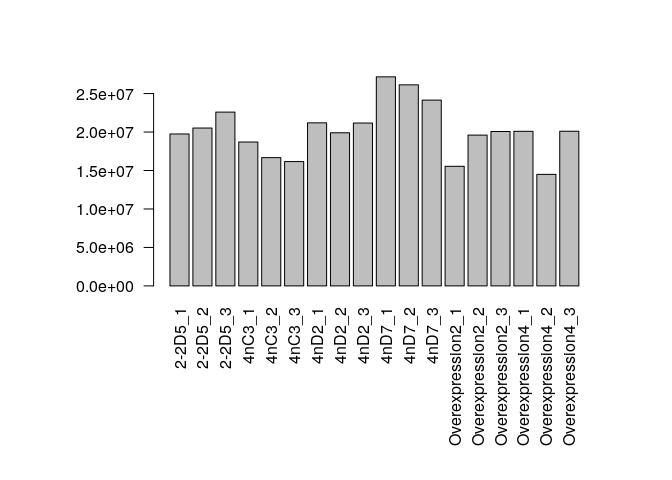
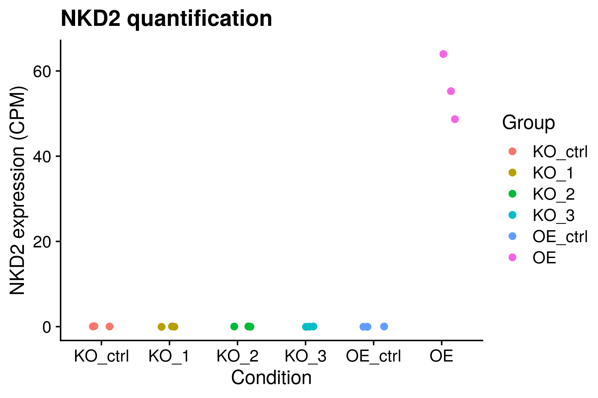
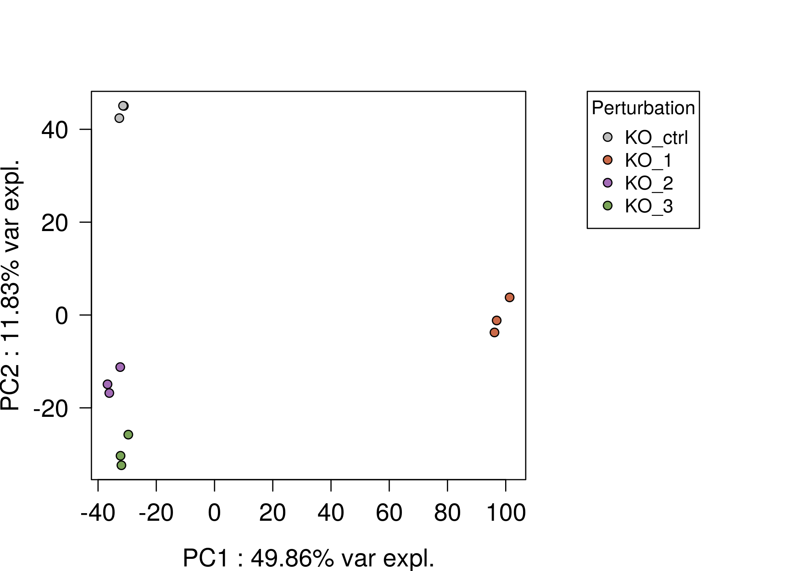
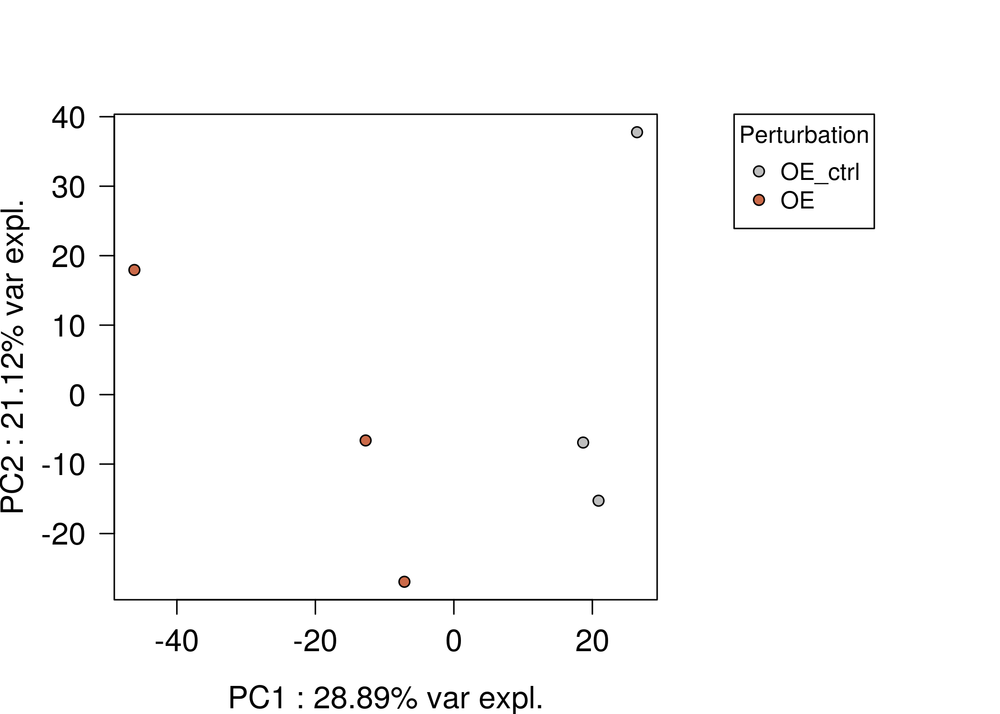

Exploratory Data Analysis (EDA) on bulk RNA-seq from in-vitro
Myofibroblast with different perturbations on NKD2
================
Javier Perales-Patón - <javier.perales@bioquant.uni-heidelberg.de> -
ORCID: 0000-0003-0780-6683

Transcriptome profiling with conventional RNAseq was performed in three
replicates of myofibroblasts carrying different gene perturbationss on
NKD2 (Knock-out, over-expression and corresponding controls with empty
vector). These belong to two different experiments: knock-out (KO) and
over-dispersion (OE). Thus, these are loaded at once, but explored and
analyzed independently. In the case of KO experiment, there were
generated 3 NKD2-KO clones, one of them (`nC3`) with a phenotype with a
severe collagen production. Herein we perform an exploratory analysis.

## Setting-up environment

The environment will be set with a random seed number for
reproducibility and an output folder for processed data and figures.

### set env

``` r
options(stringsAsFactors = FALSE)
# Seed number
set.seed(1234)
# Output directory
OUTDIR <- "./00_EDA_output/"
if(!dir.exists(OUTDIR)) dir.create(OUTDIR);

# Figures
FIGDIR <- paste0(OUTDIR, "/figures/")
knitr::opts_chunk$set(fig.path=FIGDIR)
knitr::opts_chunk$set(dev=c('png', 'pdf'))
# Data
DATADIR <- paste0(OUTDIR, "/data/")
if(!dir.exists(DATADIR)) dir.create(DATADIR);

# If already exists, clean dirs?
clean_dirs <- TRUE
if(clean_dirs) {
    unlink(list.files(OUTDIR, full.names=TRUE, recursive = TRUE))
}
# Color palette
cols <- c("grey","#cb6a49", "#a46cb7","#7aa457")
```

### Load libraries

Essential libraries for R analysis.

``` r
library(edgeR)
library(limma)
library(fgsea)
library(GSEABase)
library(ggplot2)
library(cowplot)
library(SummarizedExperiment)
library(csaw)
fontTXT <- "sans"
```

## Load data and normalize

``` r
### 1 Load data
# Source: https://bioconductor.org/packages/release/bioc/vignettes/tximport/inst/doc/tximport.html#limma-voom
load("../data/bulk-rnaseq/forJavier.RData")
# The sample IDs are stored in the folder from the file that was imported to R. We recall them
sname <- sapply(dirname(filenames),function(z) paste(strsplit(z, split="_")[[1]][1:2],collapse="_"))
# We get the read counts per sample
cnt <- txi$counts
# Rename samples
colnames(cnt) <- sname
# Get the biological conditions
group_str <- as.character(group)
group_str <- gsub("-","_", group_str)
group_str <- gsub("OverExpr","OE",group_str)
```

### Knock-out experiment

Define data experiment

``` r
KO_idx <- grep("^KO", group_str)
KO_cnt <- cnt[, KO_idx]
KO_gr <- factor(group_str[KO_idx])
KO_gr <- relevel(KO_gr, ref="KO_ctrl")
```

``` r
## 2 Create DGElist (edgeR package, followed by TMM default normalization method)
KO_y <- DGEList(counts = KO_cnt, group = KO_gr, genes = rownames(KO_cnt))
# Filtering
KO_keep <- filterByExpr(KO_y)
table(KO_keep)
```

    ## KO_keep
    ## FALSE  TRUE 
    ## 38850 19444

``` r
# Apply filtering
KO_y <- KO_y[KO_keep, ]
KO_y <- calcNormFactors(KO_y)

## 3 Create experimental design
stopifnot(all(KO_gr == KO_y$samples$group))
KO_design <- model.matrix(~ 0 + KO_gr) # wo/ intercept
colnames(KO_design) <- gsub("^KO_gr", "", colnames(KO_design))
KO_v <- voom(KO_y, KO_design)
```

### Over-expression experiment

Define data experiment

``` r
OE_idx <- grep("^OE", group_str)
OE_cnt <- cnt[, OE_idx]
OE_gr <- factor(group_str[OE_idx])
OE_gr <- relevel(OE_gr, ref="OE_ctrl")
```

``` r
## 2 Create DGElist (edgeR package, followed by TMM default normalization method)
OE_y <- DGEList(counts = OE_cnt, group = OE_gr, genes = rownames(OE_cnt))
# Filtering
OE_keep <- filterByExpr(OE_y)
table(OE_keep)
```

    ## OE_keep
    ## FALSE  TRUE 
    ## 38777 19517

``` r
# Apply filtering
OE_y <- OE_y[OE_keep, ]
OE_y <- calcNormFactors(OE_y)

## 3 Create experimental design
stopifnot(all(OE_gr == OE_y$samples$group))
OE_design <- model.matrix(~ 0 + OE_gr) # wo/ intercept
colnames(OE_design) <- gsub("^OE_gr", "", colnames(OE_design))
OE_v <- voom(OE_y, OE_design)
```

## Diagnostics

### The library size

``` r
par(mar=c(10,8,4,4)); 
barplot(c(KO_y$samples$lib.size, OE_y$samples$lib.size),
    names.arg = c(rownames(KO_y$samples), rownames(OE_y$samples)), 
    las=2)
```

<!-- -->

### NKD2 expression

``` r
# Source: https://bioconductor.org/packages/release/bioc/vignettes/tximport/inst/doc/tximport.html#edgeR
cts <- txi$counts
normMat <- txi$length

# Obtaining per-observation scaling factors for length, adjusted to avoid
# changing the magnitude of the counts.
normMat <- normMat/exp(rowMeans(log(normMat)))
normCts <- cts/normMat

# Computing effective library sizes from scaled counts, to account for
# composition biases between samples.
eff.lib <- calcNormFactors(normCts) * colSums(normCts)

# Combining effective library sizes with the length factors, and calculating
# offsets for a log-link GLM.
normMat <- sweep(normMat, 2, eff.lib, "*")
normMat <- log(normMat)

# Creating a DGEList object for use in edgeR.
y <- DGEList(cts)
y <- scaleOffset(y, normMat)

se <- SummarizedExperiment(assays = list(counts = y$counts, offset = y$offset))
se$totals <- y$samples$lib.size
cpms <- calculateCPM(se, use.offsets = TRUE, log = FALSE)
#

dat <- data.frame("NKD2"=cpms[grep("NKD2", rownames(cpms)),],
          "Group"=group_str)
dat$Group <- factor(dat$Group, levels=c("KO_ctrl", "KO_1", "KO_2", "KO_3",
                    "OE_ctrl", "OE")
)

ggplot(dat, aes(y=NKD2, x=Group, colour=Group)) + 
    geom_point(position=position_jitter(w=0.2, seed = 2354), size=2) +
    ggtitle("NKD2 quantification") +
    xlab("Condition") + ylab("NKD2 expression (CPM)") +
    theme_cowplot()
```

<!-- -->

> Conclusion: Libraries sizes are well balanced. Surprisingly, NKD2
> transcripts have not been sequenced in control conditions. Maybe the
> cell line presents a baseline protein levels of NKD2 to be funcional
> as it is shown in the western blot of these samples.

### Principal Component analysis

First we start with the definition of ad-hoc handle functions to quick
generate PCA plots (i.e. two-first principal components showing their
variance explained).

``` r
# Define some functions
runPCA <- function(mat) {
  pca <- prcomp(t(mat))
  
  return(pca)
}

plotPCA <- function(pca, dims, pchs, cols, labels=NULL, family="sans") {
  importance <- summary(pca)$importance[,dims]
  PCscores <- data.frame(pca$x)[,dims]
  
  plot(PCscores,las=1,
       pch=pchs,bg=cols,
       family=family,
       cex.axis=1.3, cex.lab=1.3,
       xlab=paste0(dims[1]," : ",format(round(importance[2,dims[1]]*100,digits = 2),nsmall = 2),"% var expl."),
       ylab=paste0(dims[2]," : ",format(round(importance[2,dims[2]]*100,digits = 2),nsmall = 2),"% var expl."))
  if(!is.null(labels)) {
    par(xpd=TRUE)
    text(x=PCscores[,dims[1]], y=PCscores[,dims[2]], labels=labels, pos=1, family=family)
  }
}
```

### Knock-out experiment

``` r
par(mar=c(4,4,4,12), xpd=TRUE)
# KO
plotPCA(pca=runPCA(mat = KO_v$E),
        dims=c("PC1","PC2"),
        pchs=c(21), cols=cols[as.integer(KO_gr)])
legend("topright",legend = levels(KO_gr), pch=c(21),
       pt.bg = cols[1:length(levels(KO_gr))], 
       inset = c(-0.4,0), title = "Perturbation")
```

<!-- -->

``` r
par(mar=c(4,4,4,12), xpd=TRUE)
# OE
plotPCA(pca=runPCA(mat = OE_v$E),
        dims=c("PC1","PC2"),
        pchs=c(21), cols=cols[as.integer(OE_gr)])
legend("topright",legend = levels(OE_gr), pch=c(21),
       pt.bg = cols[1:length(levels(OE_gr))], 
       inset = c(-0.4,0), title = "Perturbation")
```

<!-- -->

We conclude that biological replicates and conditions are cluster as it
would be expected given the experimental settings. The NKD2-KO clone
with more severe phenotype (`nC3`) is much more distinct to the other
phenotypes. And KO and OE experiments cluster with their corresponding
replicates.

## Session info

``` r
sessionInfo()
```

    ## R version 4.0.0 (2020-04-24)
    ## Platform: x86_64-conda_cos6-linux-gnu (64-bit)
    ## Running under: Ubuntu 18.04.3 LTS
    ## 
    ## Matrix products: default
    ## BLAS/LAPACK: /home/jperales/miniconda3/envs/kidneymap/lib/libopenblasp-r0.3.9.so
    ## 
    ## locale:
    ##  [1] LC_CTYPE=en_US.UTF-8       LC_NUMERIC=C              
    ##  [3] LC_TIME=en_GB.UTF-8        LC_COLLATE=en_US.UTF-8    
    ##  [5] LC_MONETARY=en_GB.UTF-8    LC_MESSAGES=en_US.UTF-8   
    ##  [7] LC_PAPER=en_GB.UTF-8       LC_NAME=C                 
    ##  [9] LC_ADDRESS=C               LC_TELEPHONE=C            
    ## [11] LC_MEASUREMENT=en_GB.UTF-8 LC_IDENTIFICATION=C       
    ## 
    ## attached base packages:
    ##  [1] grid      stats4    parallel  stats     graphics  grDevices utils    
    ##  [8] datasets  methods   base     
    ## 
    ## other attached packages:
    ##  [1] csaw_1.22.0                 SummarizedExperiment_1.18.1
    ##  [3] DelayedArray_0.14.0         matrixStats_0.56.0         
    ##  [5] GenomicRanges_1.40.0        GenomeInfoDb_1.24.0        
    ##  [7] cowplot_1.0.0               ggplot2_3.3.0              
    ##  [9] GSEABase_1.50.0             graph_1.66.0               
    ## [11] annotate_1.66.0             XML_3.99-0.3               
    ## [13] AnnotationDbi_1.50.0        IRanges_2.22.1             
    ## [15] S4Vectors_0.26.0            Biobase_2.48.0             
    ## [17] BiocGenerics_0.34.0         fgsea_1.14.0               
    ## [19] edgeR_3.30.0                limma_3.44.1               
    ## [21] rmarkdown_2.1               nvimcom_0.9-82             
    ## 
    ## loaded via a namespace (and not attached):
    ##  [1] bitops_1.0-6             bit64_0.9-7              progress_1.2.2          
    ##  [4] httr_1.4.1               tools_4.0.0              R6_2.4.1                
    ##  [7] DBI_1.1.0                colorspace_1.4-1         withr_2.2.0             
    ## [10] tidyselect_1.1.0         gridExtra_2.3            prettyunits_1.1.1       
    ## [13] bit_1.1-15.2             curl_4.3                 compiler_4.0.0          
    ## [16] rtracklayer_1.48.0       labeling_0.3             scales_1.1.1            
    ## [19] askpass_1.1              rappdirs_0.3.1           stringr_1.4.0           
    ## [22] digest_0.6.25            Rsamtools_2.4.0          XVector_0.28.0          
    ## [25] pkgconfig_2.0.3          htmltools_0.4.0          dbplyr_1.4.3            
    ## [28] rlang_0.4.6              RSQLite_2.2.0            generics_0.0.2          
    ## [31] farver_2.0.3             BiocParallel_1.22.0      dplyr_1.0.0             
    ## [34] RCurl_1.98-1.2           magrittr_1.5             GenomeInfoDbData_1.2.3  
    ## [37] Matrix_1.2-18            Rcpp_1.0.4.6             munsell_0.5.0           
    ## [40] lifecycle_0.2.0          stringi_1.4.6            yaml_2.2.1              
    ## [43] zlibbioc_1.34.0          BiocFileCache_1.12.0     blob_1.2.1              
    ## [46] crayon_1.3.4             lattice_0.20-41          Biostrings_2.56.0       
    ## [49] GenomicFeatures_1.40.0   hms_0.5.3                locfit_1.5-9.4          
    ## [52] knitr_1.28               pillar_1.4.4             biomaRt_2.44.0          
    ## [55] fastmatch_1.1-0          glue_1.4.1               evaluate_0.14           
    ## [58] data.table_1.12.8        vctrs_0.3.0              gtable_0.3.0            
    ## [61] openssl_1.4.1            purrr_0.3.4              assertthat_0.2.1        
    ## [64] xfun_0.14                xtable_1.8-4             tibble_3.0.1            
    ## [67] GenomicAlignments_1.24.0 memoise_1.1.0            ellipsis_0.3.1

``` r
{                                                                                                                                                                                                           
sink(file=paste0(OUTDIR,"/sessionInfo.txt"))
print(sessionInfo())
sink()
}
```
