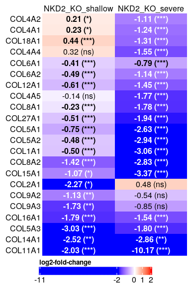

Differential expression analysis in Myofibroblast with NKD2
perturbations
================
Javier Perales-Patón - <javier.perales@bioquant.uni-heidelberg.de> -
ORCID: 0000-0003-0780-6683

> Rafael kramann’s lab has established one cell line from myofibroblasts
> from kidney bipsies with CKD. Then this cell line was transformed with
> NKD-KO, which generated three different clones carrying NKD2-KO. In
> addition, myofibroblasts were also transformed with NKD2-
> over-expression. These gene perturbations are compared with their
> corresponding empty-vector controls.

Previous script ([00\_EDA.md](./00_EDA.md)) shows that:

  - Biological replicates cluster together.

  - Theree is one KO clone that present much more differences to the
    other KO clones. With experimental observations, that clone is
    actually a clone with a fibrotic severe phenotype.

## Set-up environment

Define random seed for reproduciblity, and output folder.

``` r
# Seed number
set.seed(1234)
# Output directory
OUTDIR <- "./01_DGE_output/"
if(!dir.exists(OUTDIR)) dir.create(OUTDIR);

# Figures
FIGDIR <- paste0(OUTDIR, "/figures/")
knitr::opts_chunk$set(fig.path=FIGDIR)
knitr::opts_chunk$set(dev=c('png', 'pdf'))
# Data
DATADIR <- paste0(OUTDIR, "/data/")
if(!dir.exists(DATADIR)) dir.create(DATADIR);

# If already exists, clean dirs?
clean_dirs <- TRUE
if(clean_dirs) {
    unlink(list.files(OUTDIR, full.names=TRUE, recursive = TRUE))
}
```

## Load libraries

Essential R libraries for the analysis.

``` r
library(limma)
library(edgeR)
library(dplyr)
library(ggplot2)
library(ggrepel)
library(cowplot)
library(GSEABase)
library(fgsea)
library(reshape2)
library(gridExtra)
library(ComplexHeatmap)
library(grid)
fontTXT <- "sans"
```

## Load data and normalize

``` r
### 1 Load data
# Source: https://bioconductor.org/packages/release/bioc/vignettes/tximport/inst/doc/tximport.html#limma-voom
load("../data/bulk-rnaseq/forJavier.RData")
# The sample IDs are stored in the folder from the file that was imported to R. We recall them
sname <- sapply(dirname(filenames),function(z) paste(strsplit(z, split="_")[[1]][1:2],collapse="_"))
# We get the read counts per sample
cnt <- txi$counts
# Rename samples
colnames(cnt) <- sname
# Get the biological conditions
group_str <- as.character(group)
group_str <- gsub("-","_", group_str)
group_str <- gsub("OverExpr","OE",group_str)
```

### Knock-out experiment

Define data experiment

``` r
KO_idx <- grep("^KO", group_str)
KO_cnt <- cnt[, KO_idx]
KO_gr <- factor(group_str[KO_idx])
KO_gr <- relevel(KO_gr, ref="KO_ctrl")
```

``` r
## 2 Create DGElist (edgeR package, followed by TMM default normalization method)
KO_y <- DGEList(counts = KO_cnt, group = KO_gr, genes = rownames(KO_cnt))
# Filtering
KO_keep <- filterByExpr(KO_y)
table(KO_keep)
```

    ## KO_keep
    ## FALSE  TRUE 
    ## 38850 19444

``` r
# Apply filtering
KO_y <- KO_y[KO_keep, ]
KO_y <- calcNormFactors(KO_y)

## 3 Create experimental design
stopifnot(all(KO_gr == KO_y$samples$group))
KO_design <- model.matrix(~ 0 + KO_gr) # wo/ intercept
colnames(KO_design) <- gsub("^KO_gr", "", colnames(KO_design))
KO_v <- voom(KO_y, KO_design)

# Retrieve only gene symbols for downstream analysis
rownames(KO_v) <- sapply(rownames(KO_v), function(z) strsplit(z, split=";")[[1]][2])
```

### Over-expression experiment

Define data experiment

``` r
OE_idx <- grep("^OE", group_str)
OE_cnt <- cnt[, OE_idx]
OE_gr <- factor(group_str[OE_idx])
OE_gr <- relevel(OE_gr, ref="OE_ctrl")
```

``` r
## 2 Create DGElist (edgeR package, followed by TMM default normalization method)
OE_y <- DGEList(counts = OE_cnt, group = OE_gr, genes = rownames(OE_cnt))
# Filtering
OE_keep <- filterByExpr(OE_y)
table(OE_keep)
```

    ## OE_keep
    ## FALSE  TRUE 
    ## 38777 19517

``` r
# Apply filtering
OE_y <- OE_y[OE_keep, ]
OE_y <- calcNormFactors(OE_y)

## 3 Create experimental design
stopifnot(all(OE_gr == OE_y$samples$group))
OE_design <- model.matrix(~ 0 + OE_gr) # wo/ intercept
colnames(OE_design) <- gsub("^OE_gr", "", colnames(OE_design))
OE_v <- voom(OE_y, OE_design)

# Retrieve only gene symbols for downstream analysis
rownames(OE_v) <- sapply(rownames(OE_v), function(z) strsplit(z, split=";")[[1]][2])
```

## Test for differential expression

### Knock-out experiment

``` r
KO_fit <- lmFit(KO_v, KO_design)
KO_cont.mat <- makeContrasts("NKD2_KO_severe"=KO_1 - KO_ctrl,
              "NKD2_KO_shallow"=(KO_2 + KO_3)/2 - KO_ctrl,
                          levels=KO_design)
KO_fit <- eBayes(KO_fit)
KO_fit2 <- contrasts.fit(KO_fit, KO_cont.mat)
KO_eBay <- eBayes(KO_fit2)
```

Write tables as supplementary data for the records and further
interpretation.

``` r
for(cont in colnames(KO_cont.mat)) {
  cat(paste0("Registering differential expression for ",cont,"\n"),
    file=stdout())
  topTab <- topTable(KO_eBay, coef=cont, number = Inf)
  # DEGs table
  write.table(topTab, file=paste0(DATADIR,cont,"_diffexpr.csv"),sep=",",
                                  row.names=FALSE, col.names=TRUE, quote=FALSE)
  # Volcano plot
  plot(KO_eBay$coefficients[,cont], -log10(KO_eBay$p.value[,cont]),
       xlab="log2-fold-change", ylab="-log10(pvalue)", 
       cex=0.7, main=cont)
  # Histogram of p-vals
  hist(KO_eBay$p.value[,cont], main=cont, xlab="P-values")
}
```

    ## Registering differential expression for NKD2_KO_severe

<!-- --><!-- -->

    ## Registering differential expression for NKD2_KO_shallow

<!-- --><!-- -->

### Knock-out experiment

``` r
OE_fit <- lmFit(OE_v, OE_design)
OE_cont.mat <- makeContrasts("NKD2_OE"=OE - OE_ctrl,
                          levels=OE_design)
OE_fit <- eBayes(OE_fit)
OE_fit2 <- contrasts.fit(OE_fit, OE_cont.mat)
OE_eBay <- eBayes(OE_fit2)
```

Write tables as supplementary data for the records and further
interpretation.

``` r
for(cont in colnames(KO_cont.mat)) {
  cat(paste0("Registering differential expression for ",cont,"\n"),
    file=stdout())
  topTab <- topTable(KO_eBay, coef=cont, number = Inf)
  # DEGs table
  write.table(topTab, file=paste0(DATADIR,cont,"_diffexpr.csv"),sep=",",
                                  row.names=FALSE, col.names=TRUE, quote=FALSE)
  # Volcano plot
  plot(KO_eBay$coefficients[,cont], -log10(KO_eBay$p.value[,cont]),
       xlab="log2-fold-change", ylab="-log10(pvalue)", 
       cex=0.7, main=cont)
  # Histogram of p-vals
  hist(KO_eBay$p.value[,cont], main=cont, xlab="P-values")
}
```

    ## Registering differential expression for NKD2_KO_severe

<!-- --><!-- -->

    ## Registering differential expression for NKD2_KO_shallow

<!-- --><!-- -->

## Broad statistics on DEGs

Just check how many genes are differentially expressed

``` r
KO_DGE_cnt <- apply(decideTests(KO_eBay),2, table)
OE_DGE_cnt <- apply(decideTests(OE_eBay),2, table)
DGE_cnt <- cbind(KO_DGE_cnt, OE_DGE_cnt) 
print(DGE_cnt)
```

    ##    NKD2_KO_severe NKD2_KO_shallow NKD2_OE
    ## -1           5527            1736     168
    ## 0            8665           16566   19196
    ## 1            5252            1142     153

We could visualize the proportion of differentially expressed genes.

``` r
NGenes <- colSums(DGE_cnt)

# First dataframe with in/out
DGE_perc <- sweep(DGE_cnt,2, STATS = colSums(DGE_cnt),FUN="/")
DGE_perc <- DGE_perc*100

DGE_perc.df <- data.frame("type"=c(rep("Differential", 3),
                  rep("Unchanged",3)),
             "value"=c(colSums(DGE_perc[c("-1","1"),]),
                   DGE_perc["0",]),
             "Contrasts"=rep(colnames(DGE_perc),2))
DGE_perc.df$type <- factor(DGE_perc.df$type, levels=c("Unchanged","Differential"))

# Second dataframe with updown
DGE_perc2 <- sweep(DGE_cnt[c("-1","1"), ],2, STATS = colSums(DGE_cnt[c("-1","1"),]),FUN="/")
DGE_perc2 <- DGE_perc2*100
DGE_perc.df2 <- reshape2::melt(DGE_perc2)
DGE_perc.df2$Var1 <- factor(c("-1"="Downregulated","1"="Upregulated")[as.character(DGE_perc.df2$Var1)],
               levels=c("Downregulated","Upregulated"))
colnames(DGE_perc.df2) <- c("type","Contrasts","value")

# Pie chart code: https://stackoverflow.com/questions/16184188/ggplot-facet-piechart-placing-text-in-the-middle-of-pie-chart-slices

blank_theme <- theme_minimal()+
  theme(
  axis.title.y = element_blank(),
  panel.border = element_blank(),
  panel.grid=element_blank(),
  axis.ticks = element_blank(),
  plot.title=element_text(size=14, face="bold")
  )

for(cnt in colnames(DGE_cnt)) {
    cat(paste0("Arranging plots for ",cnt,"\n"),file=stdout())
pie1 <- ggplot(subset(DGE_perc.df,Contrasts==cnt), aes(x="", y=value, fill=type)) +
    geom_bar(width=1, stat = "identity", colour="black") +
    coord_polar("y", start=0) +
    scale_fill_manual(values=c("grey","black"), guide = guide_legend(reverse=TRUE)) +
    geom_text(aes(x=1.25,y = cumsum(value)- (0.5*value),
            label = paste0(sprintf("%1.1f",value), "%")), 
          size=6, col=c("white","black"), family=fontTXT) +
    blank_theme + 
    ylab(paste0("Total ",NGenes[cnt]," genes")) +
    theme(axis.text.x=element_blank(),
          axis.title.x = element_text(family=fontTXT,size=22),
          legend.title=element_blank(),
          legend.text = element_text(size=22, family=fontTXT),
          legend.position = c(0,0.9),
          legend.justification = c(0,0)) 

pie2 <- ggplot(subset(DGE_perc.df2,Contrasts==cnt), aes(x="", y=value, fill=type)) +
    geom_bar(width=1, stat = "identity", colour="black") +
    coord_polar("y", start=0) +
    scale_fill_manual(values=c("blue","red"), guide = guide_legend(reverse=TRUE)) +
    geom_text(aes(y = cumsum(value)- (0.5*value), 
            label = paste0(sprintf("%1.1f",value), "%")), 
          size=6, col=c("black","white"), family=fontTXT) +
    blank_theme +
    ylab(paste0(sprintf("%1.1f",
                subset(DGE_perc.df, Contrasts==cnt & 
                   type=="Differential")$value),
                "%",
            " of the total genes")) +
    theme(axis.text.x=element_blank(),
          axis.title.x = element_text(family=fontTXT,size=22),
          legend.title=element_blank(),
          legend.text = element_text(size=22, family=fontTXT),
          legend.position = c(0.2,0.9),
          legend.justification = c(0,0),
          plot.margin = unit(c(1,1,1,1), "cm"))

grid.arrange(pie1, pie2, nrow=1, top=textGrob(cnt, gp=gpar(fontsize=20)))
}
```

    ## Arranging plots for NKD2_KO_severe

<!-- -->

    ## Arranging plots for NKD2_KO_shallow

<!-- -->

    ## Arranging plots for NKD2_OE

<!-- -->

## WNT lig-rec pathway

For the records, we check the impact in genes encoding ligand and
receptors from the WNT pathway upon NKD2 perturbation.

``` r
pval2txt <- function(padj) {
padj_txt <- apply(padj, c(1,2), function(pval) {
    if(!is.na(pval)) {
           if(pval< 0.001) {
               txt <- "***"
           } else if (pval < 0.01) {
               txt <- "**"
           } else if (pval < 0.05) {
               txt <- "*"
           } else {
               txt <- "ns"
           } 
    } else {
        txt <- "n/a"
    }
    return(txt)
})

return(padj_txt)
}
```

``` r
KO_genes <- grep("^(WNT|FZD)",rownames(KO_eBay$coef), value=TRUE)
print(KO_genes)
```

    ##    ENSG00000104290.10;FZD3     ENSG00000105989.9;WNT2 
    ##                     "FZD3"                     "WNT2" 
    ##     ENSG00000108379.9;WNT3   ENSG00000111186.12;WNT5B 
    ##                     "WNT3"                    "WNT5B" 
    ##   ENSG00000114251.14;WNT5A   ENSG00000134245.17;WNT2B 
    ##                    "WNT5A"                    "WNT2B" 
    ##    ENSG00000143816.7;WNT9A     ENSG00000155760.2;FZD7 
    ##                    "WNT9A"                     "FZD7" 
    ##     ENSG00000157240.3;FZD1   ENSG00000158955.10;WNT9B 
    ##                     "FZD1"                    "WNT9B" 
    ##     ENSG00000163251.3;FZD5    ENSG00000164930.11;FZD6 
    ##                     "FZD5"                     "FZD6" 
    ##  ENSG00000169884.13;WNT10B     ENSG00000174804.3;FZD4 
    ##                   "WNT10B"                     "FZD4" 
    ##     ENSG00000177283.7;FZD8     ENSG00000180340.6;FZD2 
    ##                     "FZD8"                     "FZD2" 
    ##    ENSG00000188064.9;WNT7B     ENSG00000188763.4;FZD9 
    ##                    "WNT7B"                     "FZD9" 
    ## ENSG00000250208.6;FZD10-DT 
    ##                 "FZD10-DT"

``` r
OE_genes <- grep("^(WNT|FZD)",rownames(OE_eBay$coef), value=TRUE)
print(OE_genes)
```

    ##    ENSG00000104290.10;FZD3     ENSG00000105989.9;WNT2 
    ##                     "FZD3"                     "WNT2" 
    ##     ENSG00000108379.9;WNT3   ENSG00000111186.12;WNT5B 
    ##                     "WNT3"                    "WNT5B" 
    ##   ENSG00000114251.14;WNT5A   ENSG00000134245.17;WNT2B 
    ##                    "WNT5A"                    "WNT2B" 
    ##     ENSG00000155760.2;FZD7     ENSG00000157240.3;FZD1 
    ##                     "FZD7"                     "FZD1" 
    ##   ENSG00000158955.10;WNT9B     ENSG00000163251.3;FZD5 
    ##                    "WNT9B"                     "FZD5" 
    ##    ENSG00000164930.11;FZD6     ENSG00000174804.3;FZD4 
    ##                     "FZD6"                     "FZD4" 
    ##     ENSG00000177283.7;FZD8     ENSG00000180340.6;FZD2 
    ##                     "FZD8"                     "FZD2" 
    ##    ENSG00000188064.9;WNT7B     ENSG00000188763.4;FZD9 
    ##                    "WNT7B"                     "FZD9" 
    ## ENSG00000250208.6;FZD10-DT 
    ##                 "FZD10-DT"

``` r
# Remove a weird gene
KO_genes <- setdiff(KO_genes, "FZD10-DT")
OE_genes <- setdiff(OE_genes, "FZD10-DT")

genes <- unique(sort(c(KO_genes, OE_genes)))


# Create an empty dummy matrix
mat <- matrix(NA, ncol=3, nrow=length(genes),
          dimnames=list(genes, c(colnames(KO_cont.mat), 
                     colnames(OE_cont.mat))
                )
          )
WNT_lfc  <- WNT_fdr<- mat
# Fill out
for(cont in colnames(KO_cont.mat)) WNT_lfc[KO_genes, cont] <- KO_eBay$coef[KO_genes, cont];
for(cont in colnames(OE_cont.mat)) WNT_lfc[OE_genes, cont] <- OE_eBay$coef[OE_genes, cont];

for(cont in colnames(KO_cont.mat)) WNT_fdr[KO_genes, cont] <- p.adjust(KO_eBay$p.value[, cont], method="BH")[KO_genes];
for(cont in colnames(OE_cont.mat)) WNT_fdr[OE_genes, cont] <- p.adjust(OE_eBay$p.value[, cont], method="BH")[OE_genes];


TXT <- pval2txt(WNT_fdr)

#makeHP(WNT_lfc, WNT_fdr_txt)

col_fun <- circlize::colorRamp2(c(-2, 0, 2), c("blue","white","red"))
legend_labs <- c(floor(min(as.vector(WNT_lfc), na.rm=TRUE)),
         -2,0,2,
         ceiling(max(as.vector(WNT_lfc), na.rm=TRUE)))
legend_labs <- unique(legend_labs)
hp <- Heatmap(WNT_lfc, column_names_side="top", row_names_side="left",
          name="log2-fold-change",col=col_fun,
          heatmap_legend_param=list(direction="horizontal",
                    labels=as.character(legend_labs),
                    at=legend_labs,
                    labels_gp=gpar(fontsize=12),
                    legend_width=unit(6,"cm")),
#   show_column_dend=FALSE, show_row_dend=FALSE,     
          cluster_rows = FALSE, cluster_columns=FALSE,
    column_names_rot=0,
    column_names_centered=TRUE,
    cell_fun = function(j, i, x, y, width, height, fill) {
        if(!is.na(WNT_lfc[i,j])) {
        grid.text(paste0(sprintf("%.2f", WNT_lfc[i, j]),
                 " (",TXT[i, j],")"), 
              x, y, 
              gp = gpar(fontsize = 12,
                    fontface = ifelse(TXT[i,j]!="ns",
                              "bold","plain"),
                    col = ifelse(WNT_lfc[i,j] < -1,
                         "white","black"))
              )
        }
    }
)

draw(hp, heatmap_legend_side="bottom")
```

<!-- -->

## Single-cell derived markers

Similarly to previous section, we also checked the markers derived from
single-cell that are characteristic of myofibroblasts, and its
transcriptome modulation upon NKD2 perturbation.

``` r
genes <- scan("../data/bulk-rnaseq/singlecell_list.txt", what="character")

KO_genes <- intersect(genes, rownames(KO_v))
OE_genes <- intersect(genes, rownames(OE_v))

# Create an empty dummy matrix
mat <- matrix(NA, ncol=3, nrow=length(genes),
          dimnames=list(genes, c(colnames(KO_cont.mat), 
                     colnames(OE_cont.mat))
                )
          )
SC_lfc  <- SC_fdr<- mat
# Fill out
for(cont in colnames(KO_cont.mat)) SC_lfc[KO_genes, cont] <- KO_eBay$coef[KO_genes, cont];
for(cont in colnames(OE_cont.mat)) SC_lfc[OE_genes, cont] <- OE_eBay$coef[OE_genes, cont];

for(cont in colnames(KO_cont.mat)) SC_fdr[KO_genes, cont] <- p.adjust(KO_eBay$p.value[, cont], method="BH")[KO_genes];
for(cont in colnames(OE_cont.mat)) SC_fdr[OE_genes, cont] <- p.adjust(OE_eBay$p.value[, cont], method="BH")[OE_genes];


TXT <- pval2txt(SC_fdr)

#makeHP(SC_lfc, SC_fdr_txt)

col_fun <- circlize::colorRamp2(c(-2, 0, 2), c("blue","white","red"))
legend_labs <- c(floor(min(as.vector(SC_lfc), na.rm=TRUE)),
         -2,0,2,
         ceiling(max(as.vector(SC_lfc), na.rm=TRUE)))
legend_labs <- unique(legend_labs)
hp <- Heatmap(SC_lfc, column_names_side="top", row_names_side="left",
          name="log2-fold-change",col=col_fun,
          heatmap_legend_param=list(direction="horizontal",
                    labels=as.character(legend_labs),
                    at=legend_labs,
                    labels_gp=gpar(fontsize=12),
                    legend_width=unit(6,"cm")),
#   show_column_dend=FALSE, show_row_dend=FALSE,     
          cluster_rows = FALSE, cluster_columns=FALSE,
    column_names_rot=0,
    column_names_centered=TRUE,
    cell_fun = function(j, i, x, y, width, height, fill) {
        if(!is.na(SC_lfc[i,j])) {
        grid.text(paste0(sprintf("%.2f", SC_lfc[i, j]),
                 " (",TXT[i, j],")"), 
              x, y, 
              gp = gpar(fontsize = 12,
                    fontface = ifelse(TXT[i,j]!="ns",
                              "bold","plain"),
                    col = ifelse(SC_lfc[i,j] < -1,
                         "white","black"))
              )
        }
    }
)

draw(hp, heatmap_legend_side="bottom")
```

<!-- -->

## GSEA

Some handy functions for visualization Make a heatmap with text showing
significant hits.

``` r
### Make a heatmap of the GSEA results for the 3 contrasts
# NES is a matrix of NES
# PADJ is a matrix of strings for each cell
makeHP <- function(NES, TXT) {

hp <- Heatmap(NES, column_names_side="top", row_names_side="left",
          name="Normalized Enrichment Score (NES)",
          heatmap_legend_param=list(direction="horizontal",
                    labels_gp=gpar(fontsize=12),
                    legend_width=unit(6,"cm")),
    show_column_dend=FALSE, show_row_dend=FALSE,     
    column_names_rot=0,
    row_names_gp=gpar(fontsize=12),
        row_names_max_width = max_text_width(
                    rownames(NES), 
                    gp = gpar(fontsize = 12)),
    column_names_centered=TRUE,
    cell_fun = function(j, i, x, y, width, height, fill) {
        grid.text(TXT[i, j], x, y, 
              gp = gpar(fontsize = 12,
                    fontface = ifelse(TXT[i,j]!="ns",
                              "bold","plain"),
                    col = ifelse(NES[i,j] < -2,
                         "white","black"))
              )
    }
)
return(hp)
}
```

Barplot with significantly enriched pathways in a phenotype.

``` r
makeBP <- function(fgsea_out) {

    df <- as.data.frame(fgsea_out[,c("pathway","NES","padj")])
    df <- df[order((df$NES), decreasing=FALSE),]
    df$pathway <- gsub("^HALLMARK","",df$pathway)
    df$pathway <- gsub("_"," ",df$pathway)
    df$pathway <- factor(df$pathway, levels=unique(df$pathway))

gg <- ggplot(subset(df, padj < 0.05), aes(x=pathway, y=abs(NES), fill=NES)) + 
    geom_bar(stat="identity", width=0.5) +
    scale_fill_gradient2(low="blue",mid="white", high="red") + 
    theme_cowplot() +
    coord_flip() +
    guides(fill = guide_colourbar(title="Normalized Enrichment Score (NES)",
                   title.position="top"
                   )

           ) +
    ylab("Absolute (NES)") +
    theme(legend.position="bottom",
          legend.key.width=unit(1.5,"cm"),
          legend.title=element_text(family=fontTXT, size=16),
          legend.text=element_text(family=fontTXT, size=16),
          axis.title.y=element_blank(),
          axis.text.y=element_text(family=fontTXT, size=14),
          axis.text.x=element_text(family=fontTXT, size=18),
          axis.title.x=element_text(family=fontTXT, size=18))

    return(gg)
}
```

### HALLMARK collection

We conclude this section with the charaterization of the cellular state
in the two experiments using the hallmark gene set collection from
MsigDB. We are particularly interested in PHD2cKO Macrophages.

First we create a list with the rankings by the moderated-t statistic
for each contrast

``` r
modT <- list(NKD2_KO_severe=KO_eBay$t[,"NKD2_KO_severe"],
         NKD2_KO_shallow=KO_eBay$t[,"NKD2_KO_shallow"],
         NKD2_OE=OE_eBay$t[, "NKD2_OE"])
```

``` r
H <- getGmt("../data/MSigDB/h.all.v7.0.symbols.gmt")
H <- geneIds(H)

set.seed(1234)
H.res <- lapply(modT, function(rnk) {
  res <- fgsea(pathways = H, stats = rnk, eps=0)
  res <- res[order(res$padj, decreasing = FALSE),]
  return(res)
})

for(cont in names(H.res)) {
  res.tab <- H.res[[cont]]
  res.tab$leadingEdge <- unlist(lapply(res.tab$leadingEdge, function(z) paste(z, collapse = ",")))
  write.table(res.tab, paste0(DATADIR,cont,"_Hallmarks_gsea.csv"),sep=",",
              row.names=FALSE, col.names=TRUE, quote=FALSE)
}
```

We report the significant (FDR\<0.05) hallmarks enriched in the KO
severe phenotype.

``` r
makeBP(H.res$NKD2_KO_severe) + ggtitle("NKD2_KO_severe")
```

<!-- -->
Similarly for the KO shallow phenotype,

``` r
makeBP(H.res$NKD2_KO_shallow) + ggtitle("NKD2_KO_shallow")
```

<!-- -->

And for the OE experiment,

``` r
makeBP(H.res$NKD2_OE) + ggtitle("NKD2_KO_OE")
```

<!-- -->

We could summarize the plots above as a heatmap

``` r
#NOTE: fgsea output is sorted by p-val in the newest version!
H.nes <- lapply(H.res, function(cnt) setNames(cnt$NES, cnt$pathway))
H.nes <- lapply(H.nes, function(z) z[order(names(z))])
H.nes <- do.call("cbind", H.nes)

H.padj <- lapply(H.res, function(cnt) setNames(cnt$padj, cnt$pathway))
H.padj <- lapply(H.padj, function(z) z[order(names(z))])
H.padj <- do.call("cbind", H.padj)
H.padj_txt <- pval2txt(H.padj)

stopifnot(all(colnames(H.nes)==colnames(H.padj_txt)))
stopifnot(all(rownames(H.nes)==rownames(H.padj_txt)))

# Reformat for readibility
rownames(H.nes) <- gsub("^HALLMARK_","",rownames(H.nes))
rownames(H.padj_txt) <- gsub("^HALLMARK_","",rownames(H.padj_txt))
colnames(H.nes) <- gsub("^NKD2_","",colnames(H.nes))
colnames(H.padj_txt) <- gsub("^NKD2","",colnames(H.padj_txt))

hp <- makeHP(H.nes, H.padj_txt)
draw(hp, heatmap_legend_side="bottom")
```

<!-- -->

### ECM

Even more interesting, it is the impact of NKD2 perturbation in the
transcriptome modulation of matrisome genes.

``` r
#   # Alternative option is to use the gene set collection from MSigDB, but we found that
#   # the matrisome DB is more complete in terms of orthologs from mouse.
#   COL <- getGmt("../data/MSigDB/collagen.gmt")
#   COL <- geneIds(COL)

ECM <- read.table("../data/Matrisome/matrisome_hs_masterlist.tsv", sep="\t", 
          header=TRUE, stringsAsFactors = FALSE)
ECM <- split(ECM$Gene.Symbol,ECM$Category)
ECM <- ECM[names(ECM)!="n/a"]


set.seed(1234)
ECM.res <- lapply(modT, function(rnk) {
  res <- fgsea(pathways = ECM, stats = rnk, eps=0)
  res <- res[order(res$padj, decreasing = FALSE),]
  return(res)
})

for(cont in names(ECM.res)) {
  res.tab <- ECM.res[[cont]]
  res.tab$leadingEdge <- unlist(lapply(res.tab$leadingEdge, function(z) paste(z, collapse = ",")))
  write.table(res.tab, paste0(DATADIR,cont,"_Matrisome_gsea.csv"),sep=",",
              row.names=FALSE, col.names=TRUE, quote=FALSE)
}
# Save it
saveRDS(ECM.res, file=paste0(DATADIR,"/fgsea_ECM.rds"))
```

We make a summary heatmap of this test.

``` r
#NOTE: fgsea output is sorted by p-val in the newest version!
ECM.nes <- lapply(ECM.res, function(cnt) setNames(cnt$NES, cnt$pathway))
ECM.nes <- lapply(ECM.nes, function(z) z[order(names(z))])
ECM.nes <- do.call("cbind", ECM.nes)

ECM.padj <- lapply(ECM.res, function(cnt) setNames(cnt$padj, cnt$pathway))
ECM.padj <- lapply(ECM.padj, function(z) z[order(names(z))])
ECM.padj <- do.call("cbind", ECM.padj)
ECM.padj_txt <- pval2txt(ECM.padj)

stopifnot(all(colnames(ECM.nes)==colnames(ECM.padj_txt)))
stopifnot(all(rownames(ECM.nes)==rownames(ECM.padj_txt)))

# Reformat for readibility
colnames(ECM.nes) <- gsub("^NKD2_","",colnames(ECM.nes))
colnames(ECM.padj_txt) <- gsub("^NKD2_","",colnames(ECM.padj_txt))

hp <- makeHP(ECM.nes, ECM.padj_txt)
draw(hp, heatmap_legend_side="bottom")
```

<!-- -->

``` r
set1 <- unlist(ECM.res[[cnt]][which(ECM.res[["NKD2_KO_severe"]]$pathway=="Collagens"), 
           "leadingEdge"])
set2 <- unlist(ECM.res[[cnt]][which(ECM.res[["NKD2_KO_shallow"]]$pathway=="Collagens"), 
           "leadingEdge"])

genes <- unique(sort(c(set1, set2)))


# Create an empty dummy matrix
mat <- matrix(NA, ncol=2, nrow=length(genes),
          dimnames=list(genes, c(colnames(KO_cont.mat)))
          )
COL_lfc  <- COL_fdr<- mat

COL_lfc <- KO_eBay$coefficients[genes, ]
COL_fdr <- apply(KO_eBay$p.value, 2, function(pvals) p.adjust(pvals, method="BH")[genes])
TXT <- pval2txt(COL_fdr)

#makeHP(COL_lfc, COL_fdr_txt)

col_fun <- circlize::colorRamp2(c(-2, 0, 2), c("blue","white","red"))
legend_labs <- c(floor(min(as.vector(COL_lfc), na.rm=TRUE)),
         -2,0,2,
         ceiling(max(as.vector(COL_lfc), na.rm=TRUE)))
legend_labs <- unique(legend_labs)
hp <- Heatmap(COL_lfc, column_names_side="top", row_names_side="left",
          name="log2-fold-change",col=col_fun,
          heatmap_legend_param=list(direction="horizontal",
                    labels=as.character(legend_labs),
                    at=legend_labs,
                    labels_gp=gpar(fontsize=12),
                    legend_width=unit(6,"cm")),
    show_column_dend=FALSE, show_row_dend=FALSE,     
#         cluster_rows = FALSE, cluster_columns=FALSE,
    column_names_rot=0,
    column_names_centered=TRUE,
    cell_fun = function(j, i, x, y, width, height, fill) {
        if(!is.na(COL_lfc[i,j])) {
        grid.text(paste0(sprintf("%.2f", COL_lfc[i, j]),
                 " (",TXT[i, j],")"), 
              x, y, 
              gp = gpar(fontsize = 12,
                    fontface = ifelse(TXT[i,j]!="ns",
                              "bold","plain"),
                    col = ifelse(COL_lfc[i,j] < -1,
                         "white","black"))
              )
        }
    }
)

draw(hp, heatmap_legend_side="bottom")
```

<!-- -->

## Visualization of differentially expressed genes

We will prompt with volcano plots showing leading edge genes from each
interesting pathway that we found in the functional analysis.

``` r
make_volcano <- function(topTab, set) {

if(any(!set %in% topTab$ID)) {
    cat(paste("The following genes are not present in the gene expr matrix:","\n",
          paste(setdiff(set, rownames(topTab)), collapse=","),
          "\n"),
          file=stdout())
    set <- intersect(set, rownames(topTab))
}

topTab$significant <- ifelse(topTab$adj.P.Val < 0.05,"FDR<0.05","n.s.")
topTab$show <- topTab$ID %in% set
 
lfc <- topTab$logFC
mxpval <- max(-log10(topTab$P.Value))

p = ggplot(topTab, aes(logFC, -log10(P.Value))) +
    geom_point(aes(col=significant)) +
    scale_color_manual(values=c("red", "grey"))
  
  
p <- p+geom_label_repel(data=topTab[topTab$show,],
                          aes(label=ID), family=fontTXT, size=4,
                          force=2,
              max.iter=1e4,
#             xlim = c(ceiling(max(lfc))+1, ceiling(max(lfc))+2),
              xlim = c(floor(min(lfc))*1.5, floor(min(lfc)*1.2)),
#             xlim = c(min(lfc), 0),
                           nudge_y=0.05, 
              direction = "y", 
              segment.size = 0.3) + 
    coord_cartesian(xlim = c(floor(min(lfc)), 
                 ceiling(max(lfc))), 
            clip = "off") +
    scale_y_continuous(position="right") + 
    theme_cowplot() +
    theme(text = element_text(family=fontTXT, size=20),
      legend.text = element_text(family=fontTXT, size=20),
      legend.position = "bottom",
      legend.justification=c(1,0),
      axis.text = element_text(family=fontTXT, size=20),
        plot.margin = unit(c(0.3, 2.6, 1.0, 4.0), "cm") 
      )
return(p)

}
```

### NKD2-KO severe phenotype

``` r
cnt <- "NKD2_KO_severe"
path <- "HALLMARK_WNT_BETA_CATENIN_SIGNALING"
set <- unlist(H.res[[cnt]][which(H.res[[cnt]]$pathway==path),"leadingEdge"])
# Mac_interesting_genes <- H[["HALLMARK_WNT_BETA_CATENIN_SIGNALING"]] 
topTab <- topTable(KO_eBay, coef=cnt, number = Inf)

(make_volcano(topTab, set) + labs(title=cnt, subtitle = path))
```

<!-- -->

``` r
cnt <- "NKD2_KO_severe"
path <- "HALLMARK_TGF_BETA_SIGNALING"
set <- unlist(H.res[[cnt]][which(H.res[[cnt]]$pathway==path),"leadingEdge"])
# Mac_interesting_genes <- H[["HALLMARK_WNT_BETA_CATENIN_SIGNALING"]] 
topTab <- topTable(KO_eBay, coef=cnt, number = Inf)

(make_volcano(topTab, set) + labs(title=cnt, subtitle = path))
```

<!-- -->

We will also visualize the collagen production in this phenotype

``` r
# plotEnrichment(ECM[["Collagens"]], rnk) + labs(title="Fibroblasts PHD2")
plotGseaTable(ECM, KO_eBay$t[, "NKD2_KO_severe"], 
          ECM.res[["NKD2_KO_severe"]])  + 
    theme(text=element_text(family=fontTXT, color="black", size=18),
          axis.text=element_text(family=fontTXT, color="black", size=18)
          )
```

<!-- -->

    ## NULL

``` r
cnt <- "NKD2_KO_severe"
topTab <- topTable(KO_eBay, coef=cnt, number = Inf)
path <- "Collagens"
set <- unlist(ECM.res[[cnt]][which(ECM.res[[cnt]]$pathway=="Collagens"), "leadingEdge"])

(make_volcano(topTab, set) + labs(title=cnt, subtitle = path))
```

<!-- -->

``` r
cnt <- "NKD2_KO_shallow"
topTab <- topTable(KO_eBay, coef=cnt, number = Inf)
path <- "Collagens"
set <- unlist(ECM.res[[cnt]][which(ECM.res[[cnt]]$pathway=="Collagens"), "leadingEdge"])

(make_volcano(topTab, set) + labs(title=cnt, subtitle = path))
```

<!-- -->

### NKD2-KO shallow phenotype

``` r
cnt <- "NKD2_KO_shallow"
path <- "HALLMARK_WNT_BETA_CATENIN_SIGNALING"
set <- unlist(H.res[[cnt]][which(H.res[[cnt]]$pathway==path),"leadingEdge"])
topTab <- topTable(KO_eBay, coef=cnt, number = Inf)

(make_volcano(topTab, set) + labs(title=cnt, subtitle = path))
```

<!-- -->

``` r
cnt <- "NKD2_KO_shallow"
path <- "HALLMARK_TGF_BETA_SIGNALING"
set <- unlist(H.res[[cnt]][which(H.res[[cnt]]$pathway==path),"leadingEdge"])
# Mac_interesting_genes <- H[["HALLMARK_WNT_BETA_CATENIN_SIGNALING"]] 
topTab <- topTable(KO_eBay, coef=cnt, number = Inf)

(make_volcano(topTab, set) + labs(title=cnt, subtitle = path))
```

<!-- -->

``` r
dat <- list(NKD2_KO_severe=topTable(KO_eBay, coef="NKD2_KO_severe", number=Inf),
         NKD2_KO_shallow=topTable(KO_eBay, coef="NKD2_KO_shallow", number=Inf),
         NKD2_OE=topTable(OE_eBay, coef="NKD2_OE", number=Inf))

for(cnt in names(dat)) dat[[cnt]]$contrast <- cnt
for(cnt in names(dat)) dat[[cnt]]$ID <- rownames(dat[[cnt]])
# for(cnt in names(dat)) {
#   dat[[cnt]]$show <- FALSE
#   dat[[cnt]]$show[1:20] <- TRUE
# }
# 
dat <- do.call("rbind", dat)
dat$signif <- ifelse(dat$adj.P.Val < 0.05, "FDR<0.05", "ns")

ggplot(dat, aes(x=logFC, y=-log10(P.Value), colour=signif)) +
    geom_point(alpha=0.4) +
    geom_vline(
        xintercept = c(-1,1),
        col = "red",
        linetype = "dotted",
        size = 1) +
    geom_hline(
        yintercept = c(-log10(0.05)),
        col = "red",
        linetype = "dotted",
        size = 1)+
    scale_color_manual(values=c("orange", "grey")) +
    xlab("log2-fold-change") +
    theme_cowplot() + 
    theme(text = element_text(family=fontTXT, size=20),
      legend.text = element_text(family=fontTXT, size=20),
      legend.position = "bottom",
      axis.text = element_text(family=fontTXT, size=20),
      ) +
    facet_wrap(~ contrast)
```

<!-- -->

``` r
ggplot(dat, aes(x=P.Value)) +
    geom_histogram() +
   theme_cowplot() + 
    theme(text = element_text(family=fontTXT, size=20),
      legend.text = element_text(family=fontTXT, size=20),
      legend.position = "bottom",
      axis.text = element_text(family=fontTXT, size=20),
      ) +
    facet_wrap(~ contrast)
```

    ## `stat_bin()` using `bins = 30`. Pick better value with `binwidth`.

<!-- -->

## Save processed data

We are going to save the eBayes object for downstream analysis.

``` r
# The Elist object, with voom-transformed gene expression
saveRDS(KO_v, paste0(DATADIR,"/KO_v.rds"))
saveRDS(OE_v, paste0(DATADIR,"/OE_v.rds"))
# The eBayes object from the two contrasts
saveRDS(KO_eBay, paste0(DATADIR,"/KO_eBay.rds"))
saveRDS(OE_eBay, paste0(DATADIR,"/OE_eBay.rds"))
```

## Session info

``` r
sessionInfo()
```

    ## R version 4.0.0 (2020-04-24)
    ## Platform: x86_64-conda_cos6-linux-gnu (64-bit)
    ## Running under: Ubuntu 18.04.3 LTS
    ## 
    ## Matrix products: default
    ## BLAS/LAPACK: /home/jperales/miniconda3/envs/kidneymap/lib/libopenblasp-r0.3.9.so
    ## 
    ## locale:
    ##  [1] LC_CTYPE=en_US.UTF-8       LC_NUMERIC=C              
    ##  [3] LC_TIME=en_GB.UTF-8        LC_COLLATE=en_US.UTF-8    
    ##  [5] LC_MONETARY=en_GB.UTF-8    LC_MESSAGES=en_US.UTF-8   
    ##  [7] LC_PAPER=en_GB.UTF-8       LC_NAME=C                 
    ##  [9] LC_ADDRESS=C               LC_TELEPHONE=C            
    ## [11] LC_MEASUREMENT=en_GB.UTF-8 LC_IDENTIFICATION=C       
    ## 
    ## attached base packages:
    ##  [1] grid      stats4    parallel  stats     graphics  grDevices utils    
    ##  [8] datasets  methods   base     
    ## 
    ## other attached packages:
    ##  [1] ComplexHeatmap_2.4.2 gridExtra_2.3        reshape2_1.4.4      
    ##  [4] fgsea_1.14.0         GSEABase_1.50.0      graph_1.66.0        
    ##  [7] annotate_1.66.0      XML_3.99-0.3         AnnotationDbi_1.50.0
    ## [10] IRanges_2.22.1       S4Vectors_0.26.0     Biobase_2.48.0      
    ## [13] BiocGenerics_0.34.0  cowplot_1.0.0        ggrepel_0.8.2       
    ## [16] ggplot2_3.3.0        dplyr_1.0.0          edgeR_3.30.0        
    ## [19] limma_3.44.1         rmarkdown_2.1        nvimcom_0.9-82      
    ## 
    ## loaded via a namespace (and not attached):
    ##  [1] Rcpp_1.0.4.6        locfit_1.5-9.4      circlize_0.4.9     
    ##  [4] lattice_0.20-41     png_0.1-7           digest_0.6.25      
    ##  [7] R6_2.4.1            plyr_1.8.6          RSQLite_2.2.0      
    ## [10] evaluate_0.14       pillar_1.4.4        GlobalOptions_0.1.1
    ## [13] rlang_0.4.6         data.table_1.12.8   blob_1.2.1         
    ## [16] GetoptLong_0.1.8    Matrix_1.2-18       labeling_0.3       
    ## [19] BiocParallel_1.22.0 stringr_1.4.0       RCurl_1.98-1.2     
    ## [22] bit_1.1-15.2        munsell_0.5.0       compiler_4.0.0     
    ## [25] xfun_0.14           pkgconfig_2.0.3     shape_1.4.4        
    ## [28] htmltools_0.4.0     tidyselect_1.1.0    tibble_3.0.1       
    ## [31] crayon_1.3.4        withr_2.2.0         bitops_1.0-6       
    ## [34] xtable_1.8-4        gtable_0.3.0        lifecycle_0.2.0    
    ## [37] DBI_1.1.0           magrittr_1.5        scales_1.1.1       
    ## [40] stringi_1.4.6       farver_2.0.3        ellipsis_0.3.1     
    ## [43] generics_0.0.2      vctrs_0.3.0         fastmatch_1.1-0    
    ## [46] RColorBrewer_1.1-2  rjson_0.2.20        tools_4.0.0        
    ## [49] bit64_0.9-7         glue_1.4.1          purrr_0.3.4        
    ## [52] yaml_2.2.1          clue_0.3-57         colorspace_1.4-1   
    ## [55] cluster_2.1.0       memoise_1.1.0       knitr_1.28

``` r
{                                                                                                                                                                                                           
sink(file=paste0(OUTDIR,"/sessionInfo.txt"))
print(sessionInfo())
sink()
}
```
