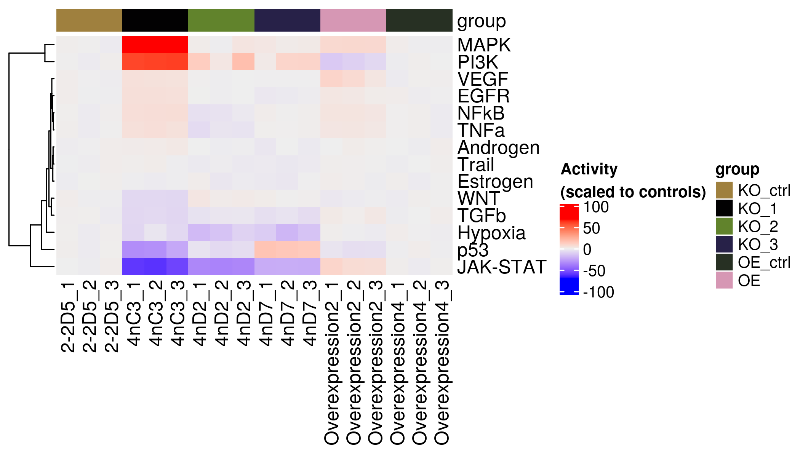
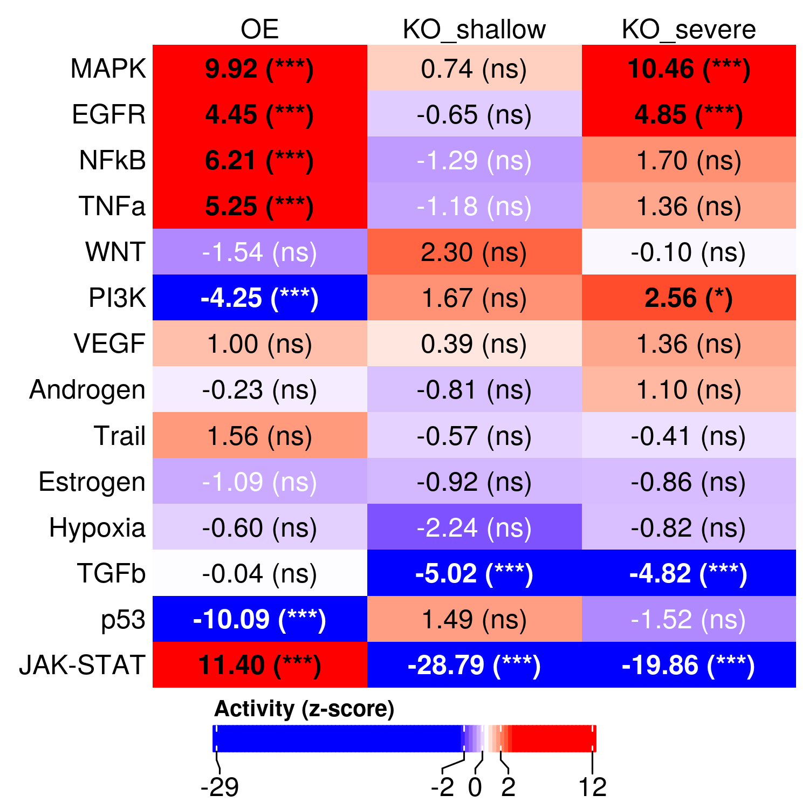

Inference of pathway activities in Myelofibroblast with NKD2 gene
perturbations in kidney
================
Javier Perales-Patón - <javier.perales@bioquant.uni-heidelberg.de> -
ORCID: 0000-0003-0780-6683

Herein we explore pathway activities on the two experiments using
PROGENy. We perform two inferences in parallel for each experiment,
using single-sample PROGENy estimates and gene-wise permutation PROGENy.

## Set-up environment

Define randome seed and output folder.

``` r
# Seed number
set.seed(1234)
# Output directory
OUTDIR <- "./02_pathway_output/"
if(!dir.exists(OUTDIR)) dir.create(OUTDIR);

# Figures
FIGDIR <- paste0(OUTDIR, "/figures/")
knitr::opts_chunk$set(fig.path=FIGDIR)
knitr::opts_chunk$set(dev=c('png', 'pdf'))
# Data
DATADIR <- paste0(OUTDIR, "/data/")
if(!dir.exists(DATADIR)) dir.create(DATADIR);
# If already exists, clean dirs?
clean_dirs <- TRUE
if(clean_dirs) {
    unlink(list.files(OUTDIR, full.names=TRUE, recursive = TRUE))
}
```

## Load libraries

Essential R libraries.

``` r
library(limma)
library(progeny)
library(broom)
library(magrittr)
library(ggplot2)
suppressPackageStartupMessages(library(ComplexHeatmap))
```

## Load data

We use the output data from previous step (01). In particular, the eBay
object from limma which contains the contrasts and statistics.

``` r
KO_v <- readRDS("./01_DGE_output/data/KO_v.rds")
KO_eBay <- readRDS("./01_DGE_output/data/KO_eBay.rds")

OE_v <- readRDS("./01_DGE_output/data/OE_v.rds")
OE_eBay <- readRDS("./01_DGE_output/data/OE_eBay.rds")
```

## PROGENy analysis

### PROGENy single-sample

First, we define a function to pathway-wise test differences using a
linear model.

``` r
test_lm <- function(pathways, controls) {
    result <- apply(pathways, 1, function(y) {
                broom::tidy(lm(y ~ !controls)) %>%
                dplyr::filter(term == "!controlsTRUE") %>%
                dplyr::select(-term)
    })
    res <- dplyr::mutate(dplyr::bind_rows(result), 
                 pathway=names(result))
    return(res)
}
```

We are going to calculate progeny scores without scaling the data. We
are going to scale it with respect the control conditions in each
contrast.

``` r
KO_prog <- progeny(KO_v$E, scale=FALSE, organism="Human", top=100)
KO_ctrls <- KO_v$targets$group == "KO_ctrl"
KO_ctrl_mean <- apply(KO_prog[KO_ctrls, ], 2, mean)
KO_ctrl_sd <- apply(KO_prog[KO_ctrls, ], 2, sd)

KO_prog <- t(apply(KO_prog, 1, function(x) x - KO_ctrl_mean))
KO_prog <- apply(KO_prog, 1, function(x) x / KO_ctrl_sd)

# Test using a linear model
## KO severe
KOsev <- KO_v$targets$group %in% c("KO_ctrl", "KO_1")
KOsev_ctrls <- KO_v$targets$group[KOsev] == "KO_ctrl"
KOsev_prog_res <- test_lm(KO_prog[, KOsev], KOsev_ctrls)
print(KOsev_prog_res)
```

    ## # A tibble: 14 x 5
    ##    estimate std.error statistic     p.value pathway 
    ##       <dbl>     <dbl>     <dbl>       <dbl> <chr>   
    ##  1    1.87      0.661     2.82  0.0477      Androgen
    ##  2    5.75      0.596     9.65  0.000644    EGFR    
    ##  3   -0.735     0.605    -1.21  0.291       Estrogen
    ##  4   -5.68      1.54     -3.68  0.0212      Hypoxia 
    ##  5  -55.6       1.56    -35.7   0.00000368  JAK-STAT
    ##  6   75.7       1.12     67.8   0.000000283 MAPK    
    ##  7    6.38      0.607    10.5   0.000463    NFkB    
    ##  8  -27.2       2.72    -10.0   0.000563    p53     
    ##  9   58.5       0.733    79.8   0.000000148 PI3K    
    ## 10   -6.97      0.616   -11.3   0.000348    TGFb    
    ## 11    5.56      0.637     8.72  0.000951    TNFa    
    ## 12    0.570     0.804     0.710 0.517       Trail   
    ## 13    5.16      0.607     8.50  0.00105     VEGF    
    ## 14   -6.90      0.602   -11.5   0.000331    WNT

``` r
## KO shallow
KOsha <- KO_v$targets$group %in% c("KO_ctrl", "KO_2", "KO_3")
KOsha_ctrls <- KO_v$targets$group[KOsha] == "KO_ctrl"
KOsha_prog_res <- test_lm(KO_prog[, KOsha], KOsha_ctrls)
print(KOsha_prog_res)
```

    ## # A tibble: 14 x 5
    ##    estimate std.error statistic  p.value pathway 
    ##       <dbl>     <dbl>     <dbl>    <dbl> <chr>   
    ##  1   -0.976     0.712    -1.37  0.213    Androgen
    ##  2   -0.811     0.637    -1.27  0.243    EGFR    
    ##  3   -1.25      0.959    -1.30  0.235    Estrogen
    ##  4  -13.2       1.96     -6.72  0.000274 Hypoxia 
    ##  5  -26.5       4.01     -6.61  0.000301 JAK-STAT
    ##  6    1.88      0.990     1.90  0.0996   MAPK    
    ##  7   -1.28      1.41     -0.913 0.392    NFkB    
    ##  8    5.01      6.63      0.756 0.474    p53     
    ##  9    9.25      3.61      2.56  0.0373   PI3K    
    ## 10   -3.70      0.804    -4.61  0.00247  TGFb    
    ## 11   -1.78      1.68     -1.06  0.325    TNFa    
    ## 12   -1.55      0.476    -3.25  0.0141   Trail   
    ## 13   -0.112     0.416    -0.269 0.796    VEGF    
    ## 14    1.49      0.775     1.92  0.0961   WNT

``` r
OE_prog <- progeny(OE_v$E, scale=FALSE, organism="Human", top=100)
OE_ctrls <- OE_v$targets$group == "OE_ctrl"
OE_ctrl_mean <- apply(OE_prog[OE_ctrls, ], 2, mean)
OE_ctrl_sd <- apply(OE_prog[OE_ctrls, ], 2, sd)

OE_prog <- t(apply(OE_prog, 1, function(x) x - OE_ctrl_mean))
OE_prog <- apply(OE_prog, 1, function(x) x / OE_ctrl_sd)

# Test using a linear model
OE_prog_res <- test_lm(OE_prog, OE_ctrls)
print(OE_prog_res)
```

    ## # A tibble: 14 x 5
    ##    estimate std.error statistic  p.value pathway 
    ##       <dbl>     <dbl>     <dbl>    <dbl> <chr>   
    ##  1    0.638     0.679     0.940 0.400    Androgen
    ##  2    2.43      0.820     2.96  0.0415   EGFR    
    ##  3    0.257     0.834     0.308 0.774    Estrogen
    ##  4   -0.274     0.838    -0.327 0.760    Hypoxia 
    ##  5    7.83      1.11      7.03  0.00216  JAK-STAT
    ##  6    8.41      0.581    14.5   0.000132 MAPK    
    ##  7    3.80      0.625     6.08  0.00370  NFkB    
    ##  8   -4.11      0.786    -5.24  0.00636  p53     
    ##  9   -9.13      1.38     -6.60  0.00273  PI3K    
    ## 10    1.92      0.769     2.50  0.0669   TGFb    
    ## 11    3.18      0.644     4.94  0.00784  TNFa    
    ## 12    0.557     0.595     0.936 0.402    Trail   
    ## 13    7.13      1.97      3.62  0.0224   VEGF    
    ## 14   -1.33      0.690    -1.93  0.126    WNT

Finally we investigate the sample-wise variability of pathway activities
for the records

``` r
mat <- cbind(KO_prog, OE_prog)
gr <- rbind(KO_v$targets[,"group",drop=FALSE],
        OE_v$targets[,"group", drop=FALSE])
hc <- HeatmapAnnotation(df=gr)
Heatmap(mat, top_annotation = hc, name="Activity\n(scaled to controls)", cluster_columns=FALSE)
```

<!-- -->

### PROGENy gene-wide permutation

``` r
# Get progeny model matrix
progeny.mat <- getModel(organism = "Human", top = 100)
progeny.mat$ID <- rownames(progeny.mat)
progeny.mat <- progeny.mat[, c("ID", setdiff(colnames(progeny.mat), "ID"))]

# Create a data.frame with the universe of genes and corresponding moderated-t
# statistics. Warn: those genes filtered out because of low expression in any
# of the two experiments are considered mot-t = 0, since it is expected that
# both conditions are 0 expresion.
IDs <- unique(c(rownames(KO_eBay$t), rownames(OE_eBay$t)))
df <- data.frame(ID=IDs,
         KO_severe=rep(0, length(IDs)),
         KO_shallow=rep(0, length(IDs)),
         OE=rep(0, length(IDs)),
         row.names=IDs)
# Fill out with mod-ts
df[rownames(KO_eBay$t), "KO_severe"] <- KO_eBay$t[, "NKD2_KO_severe"]
df[rownames(KO_eBay$t), "KO_shallow"] <- KO_eBay$t[, "NKD2_KO_shallow"]
df[rownames(OE_eBay$t), "OE"] <- OE_eBay$t[, "NKD2_OE"]

# Remove row.names
rownames(df) <- NULL
# Remove duplicated gene symbols
df <- df[which(!duplicated(df$ID)),]

set.seed(1234)
progeny.res <- progenyPerm(df, progeny.mat)
pvals <- apply(progeny.res, 2, function(z) pnorm(z))
pvals <- apply(pvals, c(1,2), function(pval) ifelse(pval > 0.5, (1-pval)*2, pval*2))
fdr <- matrix(p.adjust(as.vector(pvals), method="fdr"), ncol=ncol(pvals), nrow=nrow(pvals),
          byrow = FALSE, dimnames=dimnames(pvals))

prog <- setNames(vector("list", nrow(progeny.res)), rownames(progeny.res))
for(tag in rownames(progeny.res)) {
    # Make a simple table with the outcome
    progeny.cont <- cbind(Activity=progeny.res[tag,],Pvalue=pvals[tag,], FDR=fdr[tag,])
    # Show in stdout
    cat(paste("Pathway activity from",tag,"\n"), file=stdout())
    print(progeny.cont)
    prog[[tag]] <- progeny.cont
    # Save if as a supplementary table in a file
  write.table(progeny.cont,
              file = paste0(DATADIR,"/",tag,"_progeny.csv"),
              sep=",", col.names = NA, row.names = TRUE)
}
```

    ## Pathway activity from KO_severe 
    ##              Activity       Pvalue          FDR
    ## Androgen   1.10110280 2.708519e-01 4.118070e-01
    ## EGFR       4.85087388 1.229187e-06 5.162585e-06
    ## Estrogen  -0.85761548 3.911048e-01 5.298840e-01
    ## Hypoxia   -0.81737184 4.137160e-01 5.316522e-01
    ## JAK-STAT -19.85762871 9.467639e-88 7.952817e-87
    ## MAPK      10.45554017 0.000000e+00 0.000000e+00
    ## NFkB       1.70224860 8.870878e-02 2.191629e-01
    ## p53       -1.52376521 1.275674e-01 2.551347e-01
    ## PI3K       2.56487930 1.032117e-02 3.096351e-02
    ## TGFb      -4.82428905 1.405035e-06 5.364680e-06
    ## TNFa       1.36403501 1.725565e-01 3.030021e-01
    ## Trail     -0.40784917 6.833844e-01 7.529188e-01
    ## VEGF       1.36217063 1.731440e-01 3.030021e-01
    ## WNT       -0.09786761 9.220374e-01 9.445261e-01
    ## Pathway activity from KO_shallow 
    ##             Activity        Pvalue           FDR
    ## Androgen  -0.8103715  4.177267e-01  5.316522e-01
    ## EGFR      -0.6521080  5.143315e-01  6.171978e-01
    ## Estrogen  -0.9155890  3.598825e-01  5.038355e-01
    ## Hypoxia   -2.2383926  2.519547e-02  6.613810e-02
    ## JAK-STAT -28.7940604 2.545600e-182 2.672880e-181
    ## MAPK       0.7403753  4.590723e-01  5.670893e-01
    ## NFkB      -1.2864938  1.982708e-01  3.330949e-01
    ## p53        1.4932856  1.353625e-01  2.584192e-01
    ## PI3K       1.6714296  9.463686e-02  2.208193e-01
    ## TGFb      -5.0167963  5.254022e-07  2.451877e-06
    ## TNFa      -1.1799339  2.380265e-01  3.845044e-01
    ## Trail     -0.5707171  5.681914e-01  6.449740e-01
    ## VEGF       0.3864832  6.991389e-01  7.529188e-01
    ## WNT        2.2953228  2.171463e-02  6.080097e-02
    ## Pathway activity from OE 
    ##             Activity       Pvalue          FDR
    ## Androgen  -0.2278962 8.197270e-01 8.607133e-01
    ## EGFR       4.4454049 8.772649e-06 3.070427e-05
    ## Estrogen  -1.0926717 2.745380e-01 4.118070e-01
    ## Hypoxia   -0.5962659 5.509976e-01 6.428305e-01
    ## JAK-STAT  11.4032069 0.000000e+00 0.000000e+00
    ## MAPK       9.9152630 0.000000e+00 0.000000e+00
    ## NFkB       6.2117249 5.240612e-10 3.144367e-09
    ## p53      -10.0946813 5.832021e-24 4.082414e-23
    ## PI3K      -4.2452112 2.183876e-05 7.055599e-05
    ## TGFb      -0.0366981 9.707257e-01 9.707257e-01
    ## TNFa       5.2504238 1.517496e-07 7.966856e-07
    ## Trail      1.5624583 1.181801e-01 2.551347e-01
    ## VEGF       0.9979320 3.183123e-01 4.610041e-01
    ## WNT       -1.5363428 1.244543e-01 2.551347e-01

``` r
### Make a heatmap of the results for the 3 contrasts
# ACT is a matrix of Activity
# PADJ is a matrix of strings for each cell
makeHP <- function(ACT, TXT, cluster_col=FALSE) {

col_fun <- circlize::colorRamp2(c(-3,0,3), c("blue","white","red"))
legend_labs <- c(floor(min(as.vector(ACT))),
         -2,0,2,
         ceiling(max(as.vector(ACT))))
hp <- Heatmap(ACT, column_names_side="top", row_names_side="left",
          col=col_fun, cluster_columns=cluster_col,
          name="Activity (z-score)",

          heatmap_legend_param=list(direction="horizontal",
                    labels=as.character(legend_labs),
                    at=legend_labs,
                    labels_gp=gpar(fontsize=12),
                    legend_width=unit(6,"cm")),
    show_column_dend=FALSE, show_row_dend=FALSE,     
    column_names_rot=0,
    row_names_gp=gpar(fontsize=12),
        row_names_max_width = max_text_width(
                    rownames(ACT), 
                    gp = gpar(fontsize = 12)),
    column_names_centered=TRUE,
    cell_fun = function(j, i, x, y, width, height, fill) {
        grid.text(paste0(sprintf("%.2f", ACT[i, j]),
                 " (",TXT[i, j],")"), 
              x, y, 
              gp = gpar(fontsize = 12,
                    fontface = ifelse(TXT[i,j]!="ns",
                              "bold","plain"),
                    col = ifelse(ACT[i,j] < -1,
                         "white","black"))
              )
    }
)
return(hp)
}
```

``` r
pval2txt <- function(padj) {
padj_txt <- apply(padj, c(1,2), function(pval) {
    if(pval< 0.001) {
        txt <- "***"
    } else if (pval < 0.01) {
        txt <- "**"
    } else if (pval < 0.05) {
        txt <- "*"
    } else {
        txt <- "ns"
    }
    return(txt)
})

return(padj_txt)
}
```

``` r
ACT <- t(progeny.res)
ACT <- ACT[, rev(colnames(ACT))]
PVAL <- t(fdr)
PVAL <- PVAL[, rev(colnames(PVAL))]
stopifnot(all(colnames(ACT)==colnames(PVAL)))

TXT <- pval2txt(PVAL)

hp <- makeHP(ACT, TXT)
draw(hp, heatmap_legend_side="bottom")
```

<!-- -->

## Conclusions

> The results obtained by both approaches will be quite similar:
> JAK-STAT pathway is highly dysregulated towards NKD2 functional impact
> in a positive direction. TGFb follows this trend with a strong
> association too, but lower magnitude of dysregulation.

## Save data

``` r
saveRDS(prog, file=paste0(DATADIR,"/prog.rds"))
```

## Session info

``` r
sessionInfo()
```

    ## R version 4.0.0 (2020-04-24)
    ## Platform: x86_64-conda_cos6-linux-gnu (64-bit)
    ## Running under: Ubuntu 18.04.3 LTS
    ## 
    ## Matrix products: default
    ## BLAS/LAPACK: /home/jperales/miniconda3/envs/kidneymap/lib/libopenblasp-r0.3.9.so
    ## 
    ## locale:
    ##  [1] LC_CTYPE=en_US.UTF-8       LC_NUMERIC=C              
    ##  [3] LC_TIME=en_GB.UTF-8        LC_COLLATE=en_US.UTF-8    
    ##  [5] LC_MONETARY=en_GB.UTF-8    LC_MESSAGES=en_US.UTF-8   
    ##  [7] LC_PAPER=en_GB.UTF-8       LC_NAME=C                 
    ##  [9] LC_ADDRESS=C               LC_TELEPHONE=C            
    ## [11] LC_MEASUREMENT=en_GB.UTF-8 LC_IDENTIFICATION=C       
    ## 
    ## attached base packages:
    ## [1] grid      stats     graphics  grDevices utils     datasets  methods  
    ## [8] base     
    ## 
    ## other attached packages:
    ## [1] ComplexHeatmap_2.4.2 ggplot2_3.3.0        magrittr_1.5        
    ## [4] broom_0.5.6          progeny_1.10.0       limma_3.44.1        
    ## [7] rmarkdown_2.1        nvimcom_0.9-82      
    ## 
    ## loaded via a namespace (and not attached):
    ##  [1] circlize_0.4.9      shape_1.4.4         GetoptLong_0.1.8   
    ##  [4] tidyselect_1.1.0    xfun_0.14           purrr_0.3.4        
    ##  [7] lattice_0.20-41     colorspace_1.4-1    vctrs_0.3.0        
    ## [10] generics_0.0.2      htmltools_0.4.0     yaml_2.2.1         
    ## [13] utf8_1.1.4          rlang_0.4.6         pillar_1.4.4       
    ## [16] glue_1.4.1          withr_2.2.0         RColorBrewer_1.1-2 
    ## [19] lifecycle_0.2.0     stringr_1.4.0       munsell_0.5.0      
    ## [22] gtable_0.3.0        GlobalOptions_0.1.1 evaluate_0.14      
    ## [25] knitr_1.28          parallel_4.0.0      fansi_0.4.1        
    ## [28] Rcpp_1.0.4.6        scales_1.1.1        backports_1.1.7    
    ## [31] gridExtra_2.3       rjson_0.2.20        png_0.1-7          
    ## [34] digest_0.6.25       stringi_1.4.6       dplyr_1.0.0        
    ## [37] ggrepel_0.8.2       clue_0.3-57         cli_2.0.2          
    ## [40] tools_4.0.0         tibble_3.0.1        cluster_2.1.0      
    ## [43] crayon_1.3.4        tidyr_1.1.0         pkgconfig_2.0.3    
    ## [46] ellipsis_0.3.1      assertthat_0.2.1    R6_2.4.1           
    ## [49] nlme_3.1-148        compiler_4.0.0

``` r
{                                                                                                                                                                                                           
sink(file=paste0(OUTDIR,"/sessionInfo.txt"))
print(sessionInfo())
sink()
}
```
