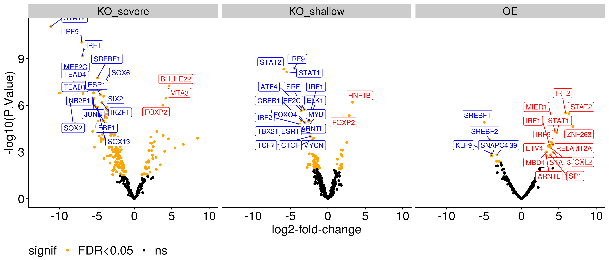

Inference of Transcription Factor activity in Myofibroblasts with NDK2
perturbations in kidney fibrosis
================
Javier Perales-Patón - <javier.perales@bioquant.uni-heidelberg.de> -
ORCID: 0000-0003-0780-6683

Herein we perform a Transcription Factor (TF) analysis on the role of
NKD2 myofibroblasts during kidney fibrosis. For that, we use normalized
data from the differential gene expression analysis and estimate TF
activities using DoRothEA human regulons.

## Setup environment

The environment will be set with a random seed number for
reproducibility and an output folder for processed data and figures.

### set env

``` r
options(stringsAsFactors = FALSE)
# Seed number
set.seed(1234)
# Output directory
OUTDIR <- "./03_TF_output/"
if(!dir.exists(OUTDIR)) dir.create(OUTDIR);

# Figures
FIGDIR <- paste0(OUTDIR, "/figures/")
knitr::opts_chunk$set(fig.path=FIGDIR)
knitr::opts_chunk$set(dev=c('png','pdf'))
# Data
DATADIR <- paste0(OUTDIR, "/data/")
if(!dir.exists(DATADIR)) dir.create(DATADIR);
# If already exists, clean dirs?
clean_dirs <- TRUE
if(clean_dirs) {
    unlink(list.files(OUTDIR, full.names=TRUE, recursive = TRUE))
}
```

### Load libraries

Essential libraries for R analysis.

``` r
library(fgsea)
library(limma)
library(viper)
library(purrr)
library(dorothea)
library(ComplexHeatmap)
library(ggplot2)
library(cowplot)
library(ggrepel)
fontTXT <- "sans"
```

## Load data

We use the output data from DGE step (01). In particular, the limma
objects which contains gene expression, statistics and design of the
contrasts.

``` r
# Knock-out experiment
KO_v <- readRDS("./01_DGE_output/data/KO_v.rds")
KO_eBay.genes <- readRDS("./01_DGE_output/data/KO_eBay.rds")

# Over-expression experiment
OE_v <- readRDS("./01_DGE_output/data/OE_v.rds")
OE_eBay.genes <- readRDS("./01_DGE_output/data/OE_eBay.rds")
```

## Transcription factor analysis using DoRothEA

``` r
# We read dorothea regulons for human
dorothea_regulon <- get(data("dorothea_hs", package="dorothea"))
# Obtain regulons based on interactions with confidence classes A,B,C
regul <- dorothea_regulon %>% dplyr::filter(confidence %in% c("A","B","C"))
# Compute VIPER scores

## Knock-out experiment
KO_TF <- run_viper(KO_v$E, regul,
        options = list(method="scale", minsize=4,
                   eset.filter=FALSE, cores=1,
                   verbose=FALSE))
## Over-expression experiment
OE_TF <- run_viper(OE_v$E, regul,
        options = list(method="scale", minsize=4,
                   eset.filter=FALSE, cores=1,
                   verbose=FALSE))
```

A handy limma test function

``` r
eBayes_limma <- function(mat, design, cont) {
    fit <- lmFit(mat, design)
    fit2 <- contrasts.fit(fit, cont)
    eBay <- eBayes(fit2)
    return(eBay)
}
```

The TF activities are estimated using `viper`. Similarly to gene-level
differential expression, contrasts performed using Empirical Bayes
method implemented in `limma`

``` r
## Knock-out experiment
KO_cont.mat <- makeContrasts("NKD2_KO_severe"=KO_1 - KO_ctrl,
              "NKD2_KO_shallow"=(KO_2 + KO_3)/2 - KO_ctrl,
                          levels=KO_v$design)
KO_eBay <- eBayes_limma(KO_TF, KO_v$design, KO_cont.mat)

## Over-expression experiment
OE_cont.mat <- makeContrasts("NKD2_OE"=OE - OE_ctrl, levels=OE_v$design)
OE_eBay <- eBayes_limma(OE_TF, OE_v$design, OE_cont.mat)
```

## Broad statistics on diff TFs

Just check how many TFs are differentially active

``` r
KO_diffTF_cnt <- apply(decideTests(KO_eBay),2, table)
OE_diffTF_cnt <- apply(decideTests(OE_eBay),2, table)
print(cbind(KO_diffTF_cnt, OE_diffTF_cnt))
```

    ##    NKD2_KO_severe NKD2_KO_shallow NKD2_OE
    ## -1            146              61       8
    ## 0             103             213     264
    ## 1              41              16      19

## Diagnostics and save results

Write tables as supplementary data for the records and further
interpretation.

``` r
show_diffTF <- function(topTab, cont, DATADIR) {
  cat(paste0("Registering differential expression for ",cont,"\n"),
    file=stdout())
  # DEGs table
  write.table(topTab, file=paste0(DATADIR, cont,"_diffTF.csv"),sep=",",
                                  row.names=TRUE, col.names=NA, quote=FALSE)
}
```

``` r
for(cont in colnames(KO_cont.mat)) {
    topTab <- topTable(KO_eBay, coef=cont, number = Inf)    
    show_diffTF(topTab, cont, DATADIR)
}
```

    ## Registering differential expression for NKD2_KO_severe
    ## Registering differential expression for NKD2_KO_shallow

``` r
for(cont in colnames(OE_cont.mat)) {
    topTab <- topTable(OE_eBay, coef=cont, number = Inf)    
    show_diffTF(topTab, cont, DATADIR)
}
```

    ## Registering differential expression for NKD2_OE

Histogram of p-values looks good, and volcano plots as well.

``` r
dat <- list("KO_severe"=topTable(KO_eBay, coef="NKD2_KO_severe", number=Inf),
        "KO_shallow"=topTable(KO_eBay, coef="NKD2_KO_shallow", number=Inf),
        "OE"=topTable(OE_eBay, coef="NKD2_OE", number=Inf))
for(cnt in names(dat)) dat[[cnt]]$contrast <- cnt
for(cnt in names(dat)) dat[[cnt]]$ID <- rownames(dat[[cnt]])
for(cnt in names(dat)) {
    dat[[cnt]]$show <- FALSE
    dat[[cnt]]$show[1:20] <- TRUE
}

dat <- do.call("rbind", dat)
dat$signif <- ifelse(dat$adj.P.Val < 0.05, "FDR<0.05", "ns")

ggplot(dat, aes(x=logFC, y=-log10(P.Value), colour=signif)) +
    geom_point() +
    geom_label_repel(data=dat[dat$show & dat$logFC < 0,],
                          aes(label=ID), 
              family=fontTXT, size=4,
                          force=2,
              color="blue",
              xlim=c(-10,0),
              ylim=c(3,15),
              segment.size = 0.5) +
    geom_label_repel(data=dat[dat$show & dat$logFC > 0,],
                          aes(label=ID), 
              family=fontTXT, size=4,
                          force=1,
              color="red",
              xlim=c(0,10),
              ylim=c(1,20)) +

    coord_cartesian(xlim = c(-13,10), 
            ylim=c(0, ceiling(max(-log10(dat$P.Value)))),
            clip = "off") +
    scale_color_manual(values=c("orange", "black")) +
    xlab("log2-fold-change") +
    theme_cowplot() + 
    theme(text = element_text(family=fontTXT, size=20),
      legend.text = element_text(family=fontTXT, size=20),
      legend.position = "bottom",
      axis.text = element_text(family=fontTXT, size=20),
      ) +
    facet_wrap(~ contrast)
```

<!-- -->

## Downstream TFs of WNT pathway

NKD2 is a well-known master regulator of WNT pathway. It controls the
WNT canonical pathway (inhibitor) and the Planar Cell Polarity pathway
(activator). In this section we test for a differential activity of TFs
that are downstream of both pathways

### WNT Canonical pathway

TCF7 seems to be dysregulated in the opposite direction as it would be
expected. NKD2 is a negative regulator of upstream signal, and it would
be expected that TCF7 is up-regulated if NKD2 is knock-out. But it shows
the opposite. LEF1 is up-regulated towards NKD2 over-expression, which
is the opposite again.

``` r
# TCF7
dat[dat$ID=="TCF7",c(1,3,4,5,7,8)]
```

    ##                     logFC         t      P.Value    adj.P.Val   contrast   ID
    ## KO_severe.TCF7  -3.240653 -6.587641 1.620026e-05 0.0001204635  KO_severe TCF7
    ## KO_shallow.TCF7 -2.337266 -5.486242 9.889769e-05 0.0015933516 KO_shallow TCF7
    ## OE.TCF7          1.671567  1.849777 7.807323e-02 0.2468095055         OE TCF7

``` r
dat[dat$ID=="TCF7L1",c(1,3,4,5,7,8)]
```

    ## [1] logFC     t         P.Value   adj.P.Val contrast  ID       
    ## <0 rows> (or 0-length row.names)

``` r
dat[dat$ID=="TCF7L2",c(1,3,4,5,7,8)]
```

    ##                        logFC          t    P.Value adj.P.Val   contrast     ID
    ## KO_severe.TCF7L2  -0.7247287 -1.7962235 0.09536498 0.1280363  KO_severe TCF7L2
    ## KO_shallow.TCF7L2  0.1046103  0.2993840 0.76930773 0.8580740 KO_shallow TCF7L2
    ## OE.TCF7L2          0.8498602  0.9456737 0.35477261 0.6069979         OE TCF7L2

``` r
# LEF1
dat[dat$ID=="LEF1",c(1,3,4,5,7,8)]
```

    ##                       logFC           t    P.Value adj.P.Val   contrast   ID
    ## KO_severe.LEF1  -0.01144183 -0.02636511 0.97936045 0.9827492  KO_severe LEF1
    ## KO_shallow.LEF1  0.75898348  2.01946232 0.06421531 0.1426889 KO_shallow LEF1
    ## OE.LEF1          2.17224023  2.33016192 0.02955438 0.1501375         OE LEF1

Let’s take a look at the leading edge of TCF7 targets:

``` r
TCF7_regul <- regul %>% dplyr::filter(tf == "TCF7")
stopifnot(all(TCF7_regul %>% dplyr::select(mor) %>% unlist() == 1))
# All targets belong to class C
TCF7_regul %>% dplyr::select(confidence) %>% unlist() %>% table()
```

    ## .
    ##  C 
    ## 61

``` r
# Get targets
TCF7_targets <- TCF7_regul %>% dplyr::select(target) %>% unlist()

# Pre-ranked GSEA on individual genes from 01_DGE
apply(KO_eBay.genes$t, 2, function(rnk) {
        fgsea(list(TCF7_targets=TCF7_targets),
              rnk)[1,"leadingEdge"] %>% unlist()
    })
```

    ##                Contrasts
    ##                 NKD2_KO_severe NKD2_KO_shallow
    ##   leadingEdge1  "SP100"        "TRIO"         
    ##   leadingEdge2  "ERAP2"        "TNFRSF11B"    
    ##   leadingEdge3  "CREM"         "SNAI2"        
    ##   leadingEdge4  "MAP3K1"       "PRR5L"        
    ##   leadingEdge5  "PRR5L"        "SP100"        
    ##   leadingEdge6  "DOCK10"       "KIAA1217"     
    ##   leadingEdge7  "RTN4"         "SKAP1"        
    ##   leadingEdge8  "DMD"          "CCND2"        
    ##   leadingEdge9  "PHACTR1"      "DMD"          
    ##   leadingEdge10 "TGFBR3"       "PLEC"         
    ##   leadingEdge11 "PLEC"         "CPPED1"       
    ##   leadingEdge12 "TNFRSF19"     "MAP3K1"       
    ##   leadingEdge13 "USP48"        "RBPJ"         
    ##   leadingEdge14 "SP140"        "MARCH8"       
    ##   leadingEdge15 "RIN3"         "RTN4"         
    ##   leadingEdge16 "KIAA1217"     "KCNK1"        
    ##   leadingEdge17 "BCL2"         "USP48"        
    ##   leadingEdge18 "TCF3"         "DTNB"         
    ##   leadingEdge19 "MARCH8"       "BIRC3"

The results of downstream TFs of WNT canonical pathway are not clear.

### WNT Planar Cell Polarity pathway

> ref: Schambony and Wedlich 2007

It seems that JUN is not consistently dysregulated upon NKD2
perturbation because the both KO do not agree, but ATF2 does.

``` r
# JUN
dat[dat$ID=="JUN",c(1,3,4,5,7,8)]
```

    ##                    logFC         t     P.Value  adj.P.Val   contrast  ID
    ## KO_severe.JUN   1.521352  3.053359 0.009098429 0.01713341  KO_severe JUN
    ## KO_shallow.JUN -1.643166 -3.808019 0.002117627 0.01395709 KO_shallow JUN
    ## OE.JUN          2.933124  2.881319 0.008770634 0.07089596         OE JUN

``` r
# ATF2
dat[dat$ID=="ATF2",c(1,3,4,5,7,8)]
```

    ##                      logFC         t     P.Value   adj.P.Val   contrast   ID
    ## KO_severe.ATF2  -0.9573424 -2.070827 0.058517036 0.084427564  KO_severe ATF2
    ## KO_shallow.ATF2 -2.0803815 -5.196235 0.000163760 0.002261447 KO_shallow ATF2
    ## OE.ATF2          3.0710870  3.246847 0.003760737 0.047581281         OE ATF2

## Conclusions

> In agreement with PROGENy, it seems that JAK-STAT transcription
> factors are dysregulated towards NK2 functional impact.

> Regarding downstream WNT pathway regulation by NKD2, it seems that JUN
> and ATF2, which are downstream TFs from WNT planar cell polarity
> pathway, might be dysregulated following the same trend. But JUN is
> not consistent. Results are not conclusive.

## Save data

``` r
saveRDS(KO_TF, file=paste0(DATADIR,"/KO_v.rds"))
saveRDS(OE_TF, file=paste0(DATADIR,"/OE_v.rds"))
saveRDS(KO_eBay, file=paste0(DATADIR,"/KO_eBay.rds"))
saveRDS(OE_eBay, file=paste0(DATADIR,"/OE_eBay.rds"))
```

## Session info

``` r
sessionInfo()
```

    ## R version 4.0.0 (2020-04-24)
    ## Platform: x86_64-conda_cos6-linux-gnu (64-bit)
    ## Running under: Ubuntu 18.04.3 LTS
    ## 
    ## Matrix products: default
    ## BLAS/LAPACK: /home/jperales/miniconda3/envs/kidneymap/lib/libopenblasp-r0.3.9.so
    ## 
    ## locale:
    ##  [1] LC_CTYPE=en_US.UTF-8       LC_NUMERIC=C              
    ##  [3] LC_TIME=en_GB.UTF-8        LC_COLLATE=en_US.UTF-8    
    ##  [5] LC_MONETARY=en_GB.UTF-8    LC_MESSAGES=en_US.UTF-8   
    ##  [7] LC_PAPER=en_GB.UTF-8       LC_NAME=C                 
    ##  [9] LC_ADDRESS=C               LC_TELEPHONE=C            
    ## [11] LC_MEASUREMENT=en_GB.UTF-8 LC_IDENTIFICATION=C       
    ## 
    ## attached base packages:
    ## [1] grid      parallel  stats     graphics  grDevices utils     datasets 
    ## [8] methods   base     
    ## 
    ## other attached packages:
    ##  [1] ggrepel_0.8.2        cowplot_1.0.0        ggplot2_3.3.0       
    ##  [4] ComplexHeatmap_2.4.2 dorothea_1.0.0       purrr_0.3.4         
    ##  [7] viper_1.22.0         Biobase_2.48.0       BiocGenerics_0.34.0 
    ## [10] limma_3.44.1         fgsea_1.14.0         rmarkdown_2.1       
    ## [13] nvimcom_0.9-82      
    ## 
    ## loaded via a namespace (and not attached):
    ##  [1] Rcpp_1.0.4.6        lattice_0.20-41     circlize_0.4.9     
    ##  [4] png_0.1-7           class_7.3-17        digest_0.6.25      
    ##  [7] R6_2.4.1            evaluate_0.14       e1071_1.7-3        
    ## [10] pillar_1.4.4        GlobalOptions_0.1.1 rlang_0.4.6        
    ## [13] data.table_1.12.8   kernlab_0.9-29      GetoptLong_0.1.8   
    ## [16] Matrix_1.2-18       labeling_0.3        splines_4.0.0      
    ## [19] BiocParallel_1.22.0 stringr_1.4.0       bcellViper_1.24.0  
    ## [22] mixtools_1.2.0      munsell_0.5.0       compiler_4.0.0     
    ## [25] xfun_0.14           pkgconfig_2.0.3     segmented_1.1-0    
    ## [28] shape_1.4.4         htmltools_0.4.0     tidyselect_1.1.0   
    ## [31] tibble_3.0.1        gridExtra_2.3       crayon_1.3.4       
    ## [34] dplyr_1.0.0         withr_2.2.0         MASS_7.3-51.6      
    ## [37] gtable_0.3.0        lifecycle_0.2.0     magrittr_1.5       
    ## [40] scales_1.1.1        KernSmooth_2.23-17  stringi_1.4.6      
    ## [43] farver_2.0.3        ellipsis_0.3.1      generics_0.0.2     
    ## [46] vctrs_0.3.0         fastmatch_1.1-0     rjson_0.2.20       
    ## [49] RColorBrewer_1.1-2  tools_4.0.0         glue_1.4.1         
    ## [52] survival_3.1-12     yaml_2.2.1          clue_0.3-57        
    ## [55] colorspace_1.4-1    cluster_2.1.0       knitr_1.28

``` r
{                                                                                                                                                                                                           
sink(file=paste0(OUTDIR,"/sessionInfo.txt"))
print(sessionInfo())
sink()
}
```
