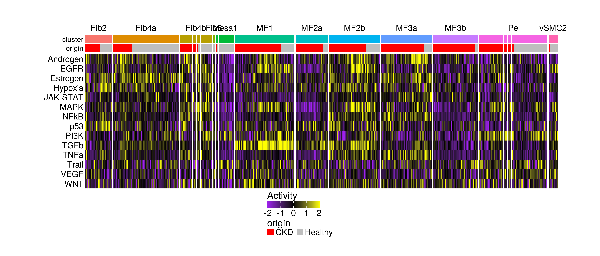
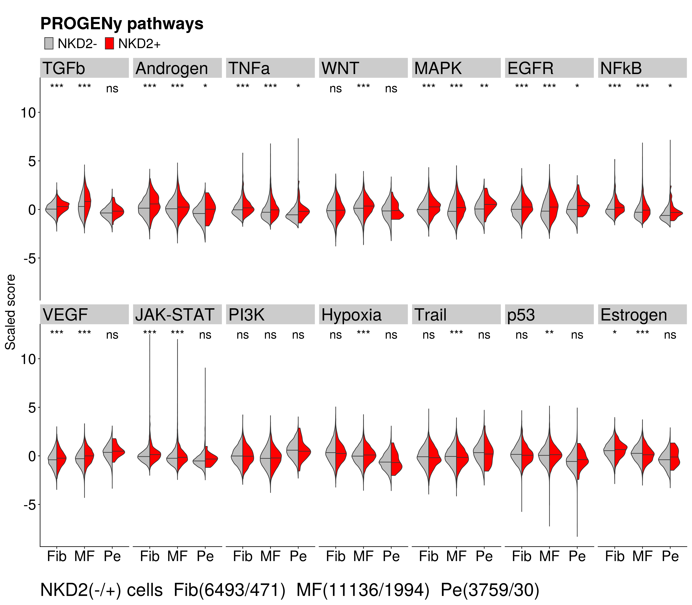
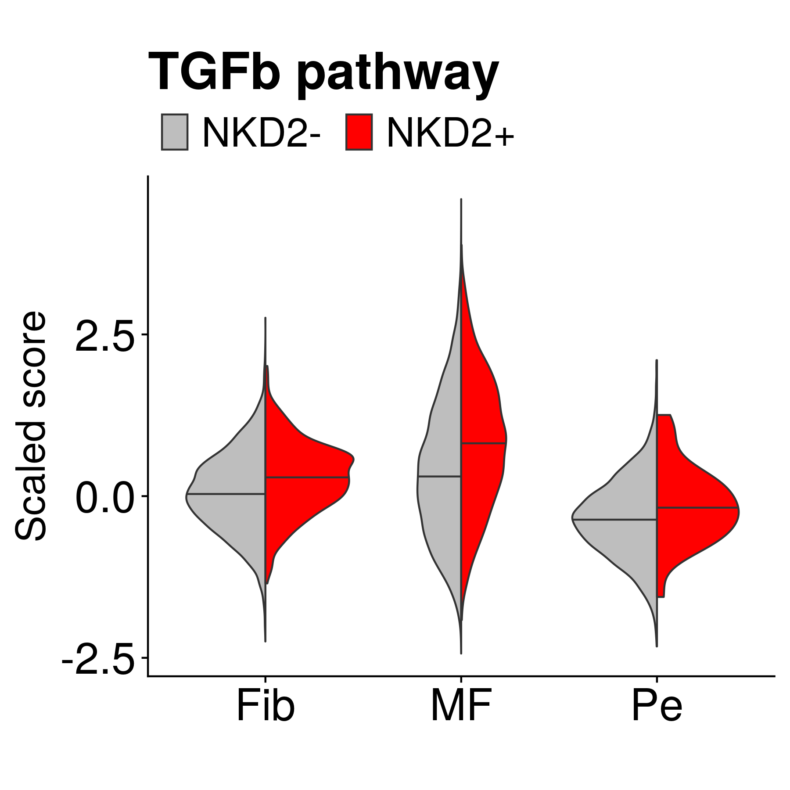
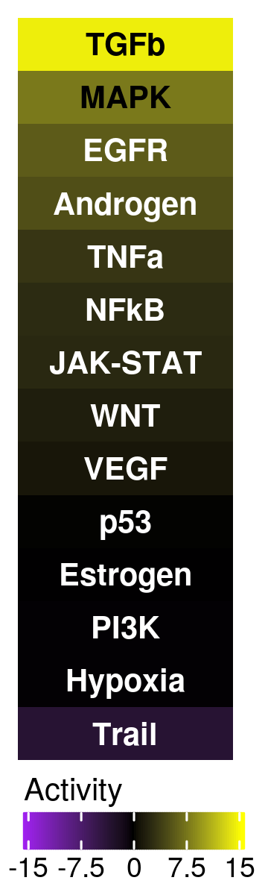
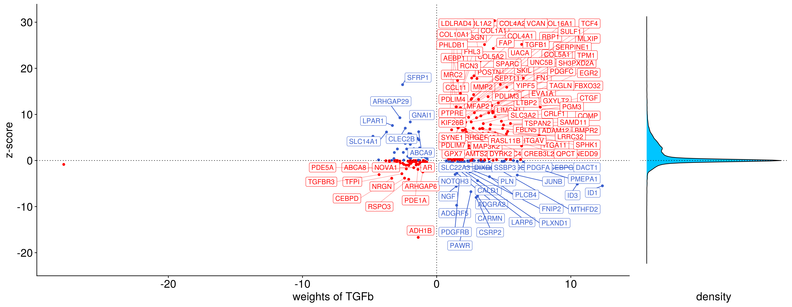

Human PDGFRb+ : pathway characterization of mesenchymal NKD2+ cells
================
Javier Perales-Patón - <javier.perales@bioquant.uni-heidelberg.de> -
ORCID: 0000-0003-0780-6683

## Setting the environment

### Internal variables

``` r
set.seed(1234)
OUTDIR <- "./human_PDGFRbpositive_02_pathway_output/";
if(!dir.exists(OUTDIR)) dir.create(OUTDIR, recursive = TRUE);

# Figures
FIGDIR <- paste0(OUTDIR, "/figures/")
knitr::opts_chunk$set(fig.path=FIGDIR)
knitr::opts_chunk$set(dev=c('png', 'pdf'))
# Data
DATADIR <- paste0(OUTDIR, "/data/")
if(!dir.exists(DATADIR)) dir.create(DATADIR);

# If already exists, clean dirs?
clean_dirs <- TRUE
if(clean_dirs) {
    unlink(list.files(OUTDIR, full.names=TRUE, recursive = TRUE))
}
```

### Load libraries

Libraries needed for the analysis

``` r
suppressPackageStartupMessages(library("Matrix"))
suppressPackageStartupMessages(library("dplyr"))
suppressPackageStartupMessages(library("ggplot2"))
suppressPackageStartupMessages(library("SingleCellExperiment"))
suppressPackageStartupMessages(library("scran"))
suppressPackageStartupMessages(library("cowplot"))
suppressPackageStartupMessages(library("ComplexHeatmap"))
suppressPackageStartupMessages(library("dorothea"))
suppressPackageStartupMessages(library("progeny"))
suppressPackageStartupMessages(library("ggrepel"))
suppressPackageStartupMessages(library("gridExtra"))
```

### Functions

An enhanced version of Seurat’s `DoHeatmap` to highlight scaled features
in single-cell dataset.

``` r
# Enhanced DoHeatmap function
DoHeatmap <- function(mat,cl,origin, 
               row_names_size=14, 
               dat="scale", column_title_size=14) {
  
  gg_color_hue <- function(n) {
    hues = seq(15, 375, length = n + 1)
    hcl(h = hues, l = 65, c = 100)[1:n]
  }
  
  gg_color_hue2 <- function(n) {
    hues = seq(15, 375, length = n + 1)
    hcl(h = hues, l = 35, c = 100)[1:n]
  }
  
  gg_color_hue3 <- function(n) {
    hues = seq(15, 375, length = n + 1)
    hcl(h = hues, l = 95, c = 100)[1:n]
  }
  
  f1 <-  circlize::colorRamp2(c(-2,0,+2), c("purple", "black", "yellow"))
 
  # Reorder
  ord <- order(as.numeric(cl), decreasing = FALSE)
  mat <- mat[,ord]
  
  cl <- cl[ord]
  cl.cols <- setNames(gg_color_hue(length(unique(cl))),levels((cl)))
  
  origin <- origin[ord]
  if(length(unique(origin)) > 2) {
      origin.cols <- setNames(gg_color_hue3(length(unique(origin))),
                          unique(as.character(origin)))
  } else if (length(unique(origin))==2) {
     origin.cols <- setNames(c("red","grey"), unique(as.character(origin)))
  }
        
   hc <- HeatmapAnnotation(df=data.frame("cluster"=as.character(cl), "origin"=origin, row.names=colnames(mat)),
                          col = list("cluster"=cl.cols, "origin"=origin.cols),
                          show_annotation_name = TRUE,annotation_name_side = "left",
                          show_legend = c(FALSE,TRUE),
              annotation_legend_param = list("cluster"=list(nrow=1),
                             "origin"=list(nrow=1, 
                                       title_gp = gpar(fontsize=16),
                                       labels_gp = gpar(fontsize=14))
                             )
              )
  # Choose main legend scale
  if(dat=="scale") {
    f1 <-  circlize::colorRamp2(c(-2,0,+2), c("purple", "black", "yellow"))
  } else if(dat=="data") {
    f1 <-  circlize::colorRamp2(c(min(as.vector(mat2)),
                    max(as.vector(mat2))),
                      c("purple","yellow"))
  } else {
      stop("ERROR: data type is not supported")
  }
  

   hp <- Heatmap(mat, cluster_rows = FALSE, cluster_columns = FALSE,col = f1,use_raster=FALSE,
                name="Activity",
        width = unit(28, "cm"),
        height = unit(8, "cm"),
                 top_annotation = hc,# bottom_annotation = hc,
                  column_split = factor(cl, levels=unique(cl)), column_title_rot=00, column_title_gp = gpar(fontsize=column_title_size), column_gap = unit(0.7, "mm"),
                heatmap_legend_param= list(legend_height = unit(4, "cm"),
                       legend_direction = "horizontal",
                                           title_gp=gpar(fontsize=16),
                                           labels_gp = gpar(fontsize = 15)),
                show_column_names = FALSE, row_names_side = "left",
                row_names_gp = gpar(fontsize=row_names_size))
  return(hp)
}
```

We also define a split-violin like plot to highlight differences between
groups.

``` r
# source: split-violin at https://stackoverflow.com/questions/35717353/split-violin-plot-with-ggplot2
# source: quantiles in split-vilin at https://stackoverflow.com/questions/47651868/split-violin-plot-with-ggplot2-with-quantiles/47652563#47652563
GeomSplitViolin <- ggproto("GeomSplitViolin", GeomViolin,
  draw_group = function(self, data, ..., draw_quantiles = NULL) {
    # Original function by Jan Gleixner (@jan-glx)
    # Adjustments by Wouter van der Bijl (@Axeman)
    data <- transform(data, xminv = x - violinwidth * (x - xmin), xmaxv = x + violinwidth * (xmax - x))
    grp <- data[1, "group"]
    newdata <- plyr::arrange(transform(data, x = if (grp %% 2 == 1) xminv else xmaxv), if (grp %% 2 == 1) y else -y)
    newdata <- rbind(newdata[1, ], newdata, newdata[nrow(newdata), ], newdata[1, ])
    newdata[c(1, nrow(newdata) - 1, nrow(newdata)), "x"] <- round(newdata[1, "x"])
    if (length(draw_quantiles) > 0 & !scales::zero_range(range(data$y))) {
      stopifnot(all(draw_quantiles >= 0), all(draw_quantiles <= 1))
      quantiles <- create_quantile_segment_frame(data, draw_quantiles, split = TRUE, grp = grp)
      aesthetics <- data[rep(1, nrow(quantiles)), setdiff(names(data), c("x", "y")), drop = FALSE]
      aesthetics$alpha <- rep(1, nrow(quantiles))
      both <- cbind(quantiles, aesthetics)
      quantile_grob <- GeomPath$draw_panel(both, ...)
      ggplot2:::ggname("geom_split_violin", grid::grobTree(GeomPolygon$draw_panel(newdata, ...), quantile_grob))
    }
    else {
      ggplot2:::ggname("geom_split_violin", GeomPolygon$draw_panel(newdata, ...))
    }
  }
)

create_quantile_segment_frame <- function(data, draw_quantiles, split = FALSE, grp = NULL) {
  dens <- cumsum(data$density) / sum(data$density)
  ecdf <- stats::approxfun(dens, data$y)
  ys <- ecdf(draw_quantiles)
  violin.xminvs <- (stats::approxfun(data$y, data$xminv))(ys)
  violin.xmaxvs <- (stats::approxfun(data$y, data$xmaxv))(ys)
  violin.xs <- (stats::approxfun(data$y, data$x))(ys)
  if (grp %% 2 == 0) {
    data.frame(
      x = ggplot2:::interleave(violin.xs, violin.xmaxvs),
      y = rep(ys, each = 2), group = rep(ys, each = 2)
    )
  } else {
    data.frame(
      x = ggplot2:::interleave(violin.xminvs, violin.xs),
      y = rep(ys, each = 2), group = rep(ys, each = 2)
    )
  }
}

geom_split_violin <- function(mapping = NULL, data = NULL, stat = "ydensity", position = "identity", ..., 
                              draw_quantiles = NULL, trim = TRUE, scale = "area", na.rm = FALSE, 
                              show.legend = NA, inherit.aes = TRUE) {
  layer(data = data, mapping = mapping, stat = stat, geom = GeomSplitViolin, position = position, 
        show.legend = show.legend, inherit.aes = inherit.aes, 
        params = list(trim = trim, scale = scale, draw_quantiles = draw_quantiles, na.rm = na.rm, ...))
}
```

An enhanced version of progenyScatter for visualization of responsive
genes to pathway perturbation.

``` r
progenyScatter2 <- function (df, weight_matrix, dfID = 1, weightID = 1, statName = "gene stats",
    verbose = FALSE)
{
    weight <- color <- ID <- NULL
    plot_list_contrasts <- list(0)
    for (i in 2:length(df[1, ])) {
        plot_list_pathways <- list(0)
        for (j in 2:length(weight_matrix[1, ])) {
            sub_df <- df[, c(dfID, i)]
            pathway_weights <- weight_matrix[, c(weightID, j)]
            names(sub_df) <- c("ID", "stat")
            minstat <- min(sub_df$stat)
            maxstat <- max(sub_df$stat)
            histo <- ggplot(sub_df, aes(x = stat, fill = "blue")) +
                geom_density() + coord_flip() + 
                geom_vline(xintercept = 0, linetype = "dotted") +
        scale_fill_manual(values = c("#00c5ff")) +
                xlim(minstat, maxstat) + theme_cowplot() + 
        theme(legend.position = "none",
                    axis.text.x = element_text(size=18, colour="white"), 
            axis.ticks.x = element_blank(),
            axis.title.y = element_blank(),
            # Otherwise both plots does not fit in same margin
            axis.title.x = element_text(size=18),
            axis.text.y = element_blank(),
            axis.ticks.y = element_blank(), 
            panel.grid.major = element_blank(),
            axis.line = element_line(colour="white"),
                panel.grid.minor = element_blank(),
        plot.background = element_rect(colour = "white", fill="white")
#       plot.margin = unit(c(1,1,1.73,1), "cm")
        )
            names(pathway_weights) <- c("ID", "weight")
            pathway_weights <- pathway_weights[pathway_weights$weight !=
                0, ]
            percentile <- ecdf(sub_df$stat)
            sub_df <- merge(sub_df, pathway_weights, by = "ID")
            sub_df$color <- "3"
            sub_df[(sub_df$weight > 0 & sub_df$stat > 0), "color"] <- "1"
            sub_df[(sub_df$weight > 0 & sub_df$stat < 0), "color"] <- "2"
            sub_df[(sub_df$weight < 0 & sub_df$stat > 0), "color"] <- "2"
            sub_df[(sub_df$weight < 0 & sub_df$stat < 0), "color"] <- "1"
            sub_df[(percentile(sub_df$stat) < 0.95 & percentile(sub_df$stat) >
                0.05), 1] <- NA

        maxwei <- max(sub_df$weight, na.rm=TRUE)
        minwei <- min(sub_df$weight, na.rm=TRUE)
            if (verbose) {
                message(paste("weights of ", names(weight_matrix)[j],
                  sep = ""))
            }
            title <- paste("weights of ", names(weight_matrix)[j],
                sep = "")
            scatterplot <- ggplot(sub_df, aes(x = weight, y = stat,
                color = color)) + geom_point() + scale_colour_manual(values = c("red",
                "royalblue3", "grey")) + 
                geom_vline(xintercept = 0, linetype = "dotted") +
                geom_hline(yintercept = 0, linetype = "dotted") +
#       geom_label_repel(aes(label = ID)) +
        # Best up-pos
        geom_label_repel(data=subset(sub_df, 
                            stat >0 & weight > 0
                         ),
                         mapping=aes(label = ID),
                 xlim=c(0,maxwei),
                 ylim=c(0,maxstat),
                 seed=1234,
                 force=2,
                 segment.alpha=0.3,
                ) +
        # Best dn-neg
        geom_label_repel(data=subset(sub_df, 
                            stat < 0 & weight < 0
                         ),
                         mapping=aes(label = ID),
                 xlim=c(minwei, 0),
                 ylim=c(minstat, 0),
                 seed=1234,
                 force=3,
                 segment.alpha=0.3,
                ) +
        # Best dn-pos
        geom_label_repel(data=subset(sub_df, 
                            stat < 0 & weight > 0
                         ),
                         mapping=aes(label = ID),
                 xlim=c(0, maxwei),
                 ylim=c(minstat,0),
                 seed=1234,
                ) +
        # Best up-neg
        geom_label_repel(data=subset(sub_df, 
                            stat > 0 & weight < 0
                         ),
                         mapping=aes(label = ID),
                 xlim=c(minwei, 0),
                 ylim=c(0, maxstat),
                 seed=1234,
                ) +
                ylim(minstat, maxstat) + theme_cowplot() + 
        theme(legend.position = "none",
              axis.text = element_text(size=18),
              axis.title = element_text(size=18),
            plot.background = element_rect(colour = "white", 
                               fill="white"),
              ) +
                labs(x = title, y = statName)
            lay <- t(as.matrix(c(1, 1, 1, 1, 2)))
            gg <- arrangeGrob(scatterplot, histo, nrow = 1, ncol = 2,
                layout_matrix = lay)
            plot_list_pathways[[j - 1]] <- gg
        }
        names(plot_list_pathways) <- names(weight_matrix[, -weightID])
        plot_list_contrasts[[i - 1]] <- plot_list_pathways
    }
    return(plot_list_contrasts)
}
```

``` r
# Short annotation
#' A handy function
#' x is a vector or elements
ann2acr <- function(x) {
    xx <- gsub("Fibroblasts?","Fib", x) 
    xx <- gsub("Myofibroblasts?","MF", xx)
    xx <- gsub("Pericytes","Pe", xx)
    xx <- gsub("Smooth Muscle Cells","SMC", xx)
    xx <- gsub("Mesangial Cells","Mesa", xx)
    xx <- gsub("^Vascular","v",xx)
    xx <- gsub(" ","", xx)
    return(xx)
}
```

ggplot2 theme with minimal elements and large fonts. Two colors for main
conditions.

``` r
theme_min <- theme_cowplot() +
    theme(
    plot.title = element_text(size=28),
      plot.margin = unit(c(1,0.3,0.3,0.3), "cm"),
      axis.text.x = element_text(size=24),
      axis.text.y = element_text(size=24),
      axis.title = element_text(size=22),
      legend.text = element_text(size=22),
      legend.title = element_blank(),
      legend.position="top",
    )

kidneyf_col <- c("grey60", "red")
kidneyf_bg <- c("grey", "red")
```

## Load data

``` r
sce <- readRDS("./human_PDGFRbpositive_01_create_sce_output/sce.rds")
```

## Prepare data for visualization

``` r
MES <- sce[,colData(sce)$Annotation.Level.1=="Mesenchymal"]
dim(MES)
```

    ## [1] 24558 25385

``` r
rownames(MES) <- rowData(MES)$Gene.Symbol
MES <- MES[!duplicated(rownames(MES)), ]
MES <- MES[, order(MES$Kidney.Function, decreasing=FALSE)]
```

``` r
# By hand: we rename the last group, unknown mesenchymal
# to avoid overlap
cl <- ann2acr(MES$Annotation.Level.3)

hp <- DoHeatmap(mat=assay(altExp(MES, "pathway")), 
        cl=as.factor(cl),
       origin=MES$Kidney.Function)
draw(hp, heatmap_legend_side="bottom", annotation_legend_side="bottom")
```

<!-- -->

## Stratification of Mesenchymal cells by NKD2 expression

Stratify cells by NKD2 expression, but also retrieve only PDGFRa/b+
cells.

``` r
colData(MES)$Strat <- NA
colData(MES)$Strat[assay(MES, "binary_lvl3")["NKD2",]==1] <- "NKD2_pos"
colData(MES)$Strat[assay(MES, "binary_lvl3")["NKD2",]==0] <- "NKD2_neg"

# We are only interested in Pericytes, Fibroblasts, Myofibroblasts
MES <- MES[, MES$Annotation.Level.2 %in% c("Fibroblasts","Myofibroblasts","Pericytes")]
# Report
table(colData(MES)$Strat)
```

    ## 
    ## NKD2_neg NKD2_pos 
    ##    21388     2495

## single-cell PROGENy estimations

We run a wilcox test to rank pathways based on differences between NKD2+
and NKD2-.

``` r
# Wilcox test to get the p-values
res <- findMarkers(assay(altExps(MES)$pathway), 
           groups=colData(MES)$Strat, 
           test.type="wilcox")

as.data.frame(res$NKD2_pos)
```

    ##          Top       p.value           FDR summary.AUC AUC.NKD2_neg
    ## TGFb       1 4.562097e-169 6.386936e-168   0.6692633    0.6692633
    ## Androgen   2  1.257046e-46  8.799323e-46   0.5875683    0.5875683
    ## TNFa       3  2.524258e-43  1.177987e-42   0.5842837    0.5842837
    ## WNT        4  1.284039e-41  4.494135e-41   0.5825359    0.5825359
    ## MAPK       5  4.031012e-40  1.128683e-39   0.5809721    0.5809721
    ## EGFR       6  4.965043e-40  1.158510e-39   0.5808766    0.5808766
    ## NFkB       7  2.880695e-36  5.761390e-36   0.5768010    0.5768010
    ## VEGF       8  1.610591e-21  2.818534e-21   0.5581866    0.5581866
    ## JAK-STAT   9  3.481489e-19  5.415649e-19   0.5546736    0.5546736
    ## PI3K      10  1.685647e-13  2.359906e-13   0.4549800    0.4549800
    ## Hypoxia   11  4.576807e-13  5.825027e-13   0.5441997    0.5441997
    ## Trail     12  4.982326e-12  5.812714e-12   0.4578231    0.4578231
    ## p53       13  6.845187e-12  7.371740e-12   0.5419006    0.5419006
    ## Estrogen  14  4.385688e-01  4.385688e-01   0.4952693    0.4952693

``` r
tags <- data.frame("pathway"=rownames(res$NKD2_pos),
           "pathway_sign"=paste0("Top #",res$NKD2_pos$Top,
                     " : ", rownames(res$NKD2_pos))
#                    " (FDR =", formatC(res$NKD2_pos$FDR, format = "e", digits = 2),")")
           )
tags$pathway_sign <- factor(tags$pathway_sign, levels=tags$pathway_sign)

# Save results
write.table(as.data.frame(res$NKD2_pos), 
        file=paste0(DATADIR,"/pooledNKD2_progeny_wilcox.csv"), sep=",", 
        col.names=NA, row.names=TRUE, quote=FALSE)
```

Actually, we re-run the test for independent cell types to get an
estimation of the difference in each one of them, based on the
differences between NKD2+ and NKD2-.

``` r
RES <- sapply(unique(colData(MES)$Annotation.Level.2), function(cell) {
        cell.idx <- which(colData(MES)$Annotation.Level.2==cell)
        findMarkers(assay(altExps(MES)$pathway)[, cell.idx], 
                groups=colData(MES)$Strat[cell.idx], 
                test.type="wilcox")
        })
RES <- lapply(RES, function(z) z$NKD2_pos)
for (cl in names(RES)) {
        RES[[cl]]$pathway <- rownames(RES[[cl]])
        RES[[cl]]$CellType <- cl
} 
RES <- do.call("rbind", RES)
# Multiple testing correction (FDR)
RES$FDR <- p.adjust(RES$p.value, method="fdr")
RES <- as.data.frame(RES)
# Reorder rows,cols
rownames(RES) <- NULL
col1st <- c("CellType","pathway")
RES <- RES[, c(col1st, setdiff(colnames(RES), col1st))]
rm(col1st)
# Save results
write.table(RES, 
        file=paste0(DATADIR,"/wilcox_significance_for_extended_data_Fig10c.csv"), sep=",", 
        col.names=TRUE, row.names=FALSE, quote=FALSE)

# add tag for visualization
RES$tag <- sapply(RES$FDR, function(pval) {
    if(pval< 0.001) {
        txt <- "***"
    } else if (pval < 0.01) {
        txt <- "**"
    } else if (pval < 0.05) {
        txt <- "*"
    } else {
        txt <- "ns"
    }
    return(txt)
        })
```

Prepare data for visualization (single-cell estimates) with significance
as annotation.

``` r
dat <- reshape2::melt(assay(altExps(MES)$pathway))
colnames(dat) <- c("pathway", "cellID", "score")
dat$Strat <- ifelse(colData(MES)[dat$cellID, "Strat"]=="NKD2_pos", "NKD2+", "NKD2-")
dat$ann2 <- colData(MES)[dat$cellID, "Annotation.Level.2"]
dat$sann2 <- ann2acr(dat$ann2)
dat <- merge(dat, tags, by.x="pathway", by.y="pathway", all.x=TRUE, all.y=FALSE)

# Order levels (pathways) by significance
dat$pathway <- factor(as.character(dat$pathway),
              levels=unique(as.character(dat$pathway[order(dat$pathway_sign)])))

# For the records, how many (n) cells in each group
ncells <- table(dat$sann2,dat$Strat)/length(unique(dat$pathway_sign))
print(ncells)
```

    ##      
    ##       NKD2- NKD2+
    ##   Fib  6493   471
    ##   MF  11136  1994
    ##   Pe   3759    30

For annotating significance, we add some data

``` r
dat$key <- paste0(dat$ann2,"_",dat$pathway) 
RES$key <- paste0(RES$CellType,"_",RES$pathway) 
dat <- merge(dat, RES[,c("FDR", "tag", "key")], 
         by.x="key", by.y="key", all.x=TRUE, all.y=FALSE)
dat$maxscore <- max(dat$score)
# Only one tag per key2, that is, per group by pathway. 
# So plot is not overwritten per each cellID (observation)
dat$key2 <- paste0(dat$pathway_sign,"_", dat$sann2,"_",dat$maxscore)
dat$tag2 <- NA 
dat$tag2[!duplicated(dat$key2)] <- dat$tag[!duplicated(dat$key2)]
```

We visualize the differences between populations as a violin plot split
by NKD2 expression.

``` r
ncells_ann <- paste0("NKD2(-/+) cells","  ",
             rownames(ncells)[1],"(", paste(ncells[1,c("NKD2-","NKD2+")], collapse="/"),")","  ",
             rownames(ncells)[2],"(", paste(ncells[2,c("NKD2-","NKD2+")], collapse="/"),")","  ",
             rownames(ncells)[3],"(", paste(ncells[3,c("NKD2-","NKD2+")], collapse="/"),")","  "
        )

ggplot(dat,
       aes(x=sann2, y=score, fill=Strat)) +
    geom_split_violin(draw_quantiles = 0.5) + facet_wrap(.~ pathway,nrow=2) + 
    geom_text(aes(x=sann2, y=maxscore, label=tag2),
          position = position_dodge(width = 0),
          hjust = 0.5, size = 7) +
scale_fill_manual(values=kidneyf_bg) +
scale_colour_manual(values=kidneyf_col) +
    xlab("") + ggtitle("PROGENy pathways") + ylab("Scaled score") +
    theme_min + 
    labs(caption = ncells_ann) + 
    theme(strip.text.x = element_text(size=28, colour="black",hjust=0),
      plot.caption = element_text(size=30, colour="black", hjust=0)
      ) 
```

<!-- -->

We zoom-in in TGFb: the most differentially active pathway in NKD2+
cells.

``` r
ggplot(subset(dat, pathway=="TGFb"),
       aes(x=sann2, y=score, fill=Strat)) +
    geom_split_violin(draw_quantiles = 0.5) +
scale_fill_manual(values=kidneyf_bg) +
scale_colour_manual(values=kidneyf_col) +
    xlab("") + ggtitle("TGFb pathway") + ylab("Scaled score") +
    theme_min
```

<!-- -->

> We could observe the higher activity of TGFb in NKD2+ cells among
> Fibroblasts, Myofibroblasts and Pericytes.

## PROGENy on contrasts (based on gene-wise permutation of rankings)

Signature extraction for NKD2+ MES

``` r
# Wilcox test to get the p-values
res <- findMarkers(logcounts(MES), groups=colData(MES)$Strat, test.type="wilcox")

# Ad-hoc log-fold-change calculation to get the sign of dysregulation
lfc <- rowMeans(logcounts(MES)[,which(colData(MES)$Strat=="NKD2_pos")]) - 
    rowMeans(logcounts(MES)[,which(colData(MES)$Strat=="NKD2_neg")])

# Volcano plot
df <- data.frame(lfc=lfc[rownames(res$NKD2_pos)],
         pval=res$NKD2_pos$p.value,
         FDR=res$NKD2_pos$FDR,
         row.names=rownames(res$NKD2_pos))

df <- df[which(rownames(df)!="NKD2"),]
df <- df[which(rownames(df)!=""),]
```

``` r
signat <- setNames(-log10(df$pval) * sign(df$lfc), rownames(df))
signat <- na.omit(signat)
```

We first calculate zscores from the wilcox test for a gene-permutation
PROGENy estimation.

``` r
# src: gCMAP::zScores
zScores <- function(pval, direction=NULL, tails=2,limit=.Machine$double.xmin) {
  if( !is.null( limit ) ){
    pval[which(pval < limit )] <- limit ## set lower limit to avoid Inf/-Inf zscores
  }
  if( tails == 2){
    z <- qnorm( pval/2, lower.tail=FALSE )
  } else if( tails == 1){
    z <- qnorm(pval, lower.tail = FALSE)
  } else {
    stop( "Parameter 'tails' must be set to either 1 or 2.")
  }
  if ( !is.null( direction) ) {
    z <-  z * sign( direction )
  }
  z
}

zz <- zScores(df$pval, df$lfc, tails=2)
signat.df <- data.frame(ID=rownames(df), NKD2=zz)
```

We calculate the PROGENy estimations in the contrast.

``` r
mod <- getModel(organism = "Human", top = 500)
mod_cols <- colnames(mod)
mod$ID <- rownames(mod)
mod <- mod[,c("ID",mod_cols)]


pathway_scores <- progenyPerm(df=signat.df,
            weight_matrix=mod,
            k=10000,
            z_scores=TRUE)
rownames(pathway_scores)<- NULL

path_mat <- t(pathway_scores)
path_mat <- path_mat[order(path_mat[,1],decreasing=TRUE),,drop=FALSE]

pscore_max <- ceiling(max(abs(as.vector(pathway_scores))))
col_fun <- circlize::colorRamp2(c(pscore_max,
                  0,
                  -1*pscore_max),
                c("yellow","black","purple"))
hp <- Heatmap(path_mat, 
          col=col_fun,
    name="Activity",
    cluster_rows=FALSE, cluster_columns=FALSE, row_names_gp = gpar(fontsize=0),
                heatmap_legend_param= list(legend_direction = "horizontal", 
                       legend_width = unit(2.5,"cm"),
                       at=seq(from=-1*pscore_max,
                          to=pscore_max,
                          length.out=5),
                       title_gp=gpar(fontsize=10),
                       labels_gp=gpar(fontsize=9)),
    cell_fun=function(j,i,x,y,width, height,fill) {
        grid.text(rownames(path_mat)[i], x, y, gp=gpar(fontsize=10, 
                                   fontface="bold",
                                   col=ifelse(abs(path_mat[i,j])>6.5, "black","white")))
    })
draw(hp, heatmap_legend_side="bottom")
```

<!-- -->

``` r
scat_plots <- progenyScatter2(df=signat.df, weight_matrix=mod, 
                 statName="z-score",verbose=FALSE)
 
plot(scat_plots[[1]]$`TGFb`)
```

<!-- -->

> Run PROGENy on contrasts is in agreement with single-cell PROGENy
> estimates. TGFb is the most active pathway in NKD2+ mesenchymal cells.

## SessionInfo

``` r
sessionInfo()
```

    ## R version 4.0.0 (2020-04-24)
    ## Platform: x86_64-conda_cos6-linux-gnu (64-bit)
    ## Running under: Ubuntu 18.04.3 LTS
    ## 
    ## Matrix products: default
    ## BLAS/LAPACK: /home/jperales/miniconda3/envs/kidneymap/lib/libopenblasp-r0.3.9.so
    ## 
    ## locale:
    ##  [1] LC_CTYPE=en_US.UTF-8       LC_NUMERIC=C              
    ##  [3] LC_TIME=en_GB.UTF-8        LC_COLLATE=en_US.UTF-8    
    ##  [5] LC_MONETARY=en_GB.UTF-8    LC_MESSAGES=en_US.UTF-8   
    ##  [7] LC_PAPER=en_GB.UTF-8       LC_NAME=C                 
    ##  [9] LC_ADDRESS=C               LC_TELEPHONE=C            
    ## [11] LC_MEASUREMENT=en_GB.UTF-8 LC_IDENTIFICATION=C       
    ## 
    ## attached base packages:
    ##  [1] grid      parallel  stats4    stats     graphics  grDevices utils    
    ##  [8] datasets  methods   base     
    ## 
    ## other attached packages:
    ##  [1] gridExtra_2.3               ggrepel_0.8.2              
    ##  [3] progeny_1.10.0              dorothea_1.0.0             
    ##  [5] ComplexHeatmap_2.4.2        cowplot_1.0.0              
    ##  [7] scran_1.16.0                SingleCellExperiment_1.10.1
    ##  [9] SummarizedExperiment_1.18.1 DelayedArray_0.14.0        
    ## [11] matrixStats_0.56.0          Biobase_2.48.0             
    ## [13] GenomicRanges_1.40.0        GenomeInfoDb_1.24.0        
    ## [15] IRanges_2.22.1              S4Vectors_0.26.0           
    ## [17] BiocGenerics_0.34.0         ggplot2_3.3.0              
    ## [19] dplyr_1.0.0                 Matrix_1.2-18              
    ## [21] rmarkdown_2.1               nvimcom_0.9-82             
    ## 
    ## loaded via a namespace (and not attached):
    ##  [1] viridis_0.5.1             tidyr_1.1.0              
    ##  [3] edgeR_3.30.0              BiocSingular_1.4.0       
    ##  [5] viridisLite_0.3.0         DelayedMatrixStats_1.10.0
    ##  [7] statmod_1.4.34            dqrng_0.2.1              
    ##  [9] GenomeInfoDbData_1.2.3    vipor_0.4.5              
    ## [11] yaml_2.2.1                pillar_1.4.4             
    ## [13] lattice_0.20-41           beachmat_2.4.0           
    ## [15] glue_1.4.1                limma_3.44.1             
    ## [17] digest_0.6.25             RColorBrewer_1.1-2       
    ## [19] XVector_0.28.0            colorspace_1.4-1         
    ## [21] plyr_1.8.6                htmltools_0.4.0          
    ## [23] pkgconfig_2.0.3           GetoptLong_0.1.8         
    ## [25] zlibbioc_1.34.0           purrr_0.3.4              
    ## [27] scales_1.1.1              BiocParallel_1.22.0      
    ## [29] tibble_3.0.1              farver_2.0.3             
    ## [31] generics_0.0.2            ellipsis_0.3.1           
    ## [33] withr_2.2.0               magrittr_1.5             
    ## [35] crayon_1.3.4              evaluate_0.14            
    ## [37] beeswarm_0.2.3            tools_4.0.0              
    ## [39] scater_1.16.0             GlobalOptions_0.1.1      
    ## [41] lifecycle_0.2.0           stringr_1.4.0            
    ## [43] bcellViper_1.24.0         munsell_0.5.0            
    ## [45] locfit_1.5-9.4            cluster_2.1.0            
    ## [47] irlba_2.3.3               compiler_4.0.0           
    ## [49] rsvd_1.0.3                rlang_0.4.6              
    ## [51] RCurl_1.98-1.2            BiocNeighbors_1.6.0      
    ## [53] rjson_0.2.20              circlize_0.4.9           
    ## [55] igraph_1.2.5              labeling_0.3             
    ## [57] bitops_1.0-6              gtable_0.3.0             
    ## [59] reshape2_1.4.4            R6_2.4.1                 
    ## [61] knitr_1.28                clue_0.3-57              
    ## [63] shape_1.4.4               stringi_1.4.6            
    ## [65] ggbeeswarm_0.6.0          Rcpp_1.0.4.6             
    ## [67] vctrs_0.3.0               png_0.1-7                
    ## [69] tidyselect_1.1.0          xfun_0.14

``` r
{                                                                                                                                                                                                           
sink(file=paste0(OUTDIR,"/sessionInfo.txt"))
print(sessionInfo())
sink()
}
```
