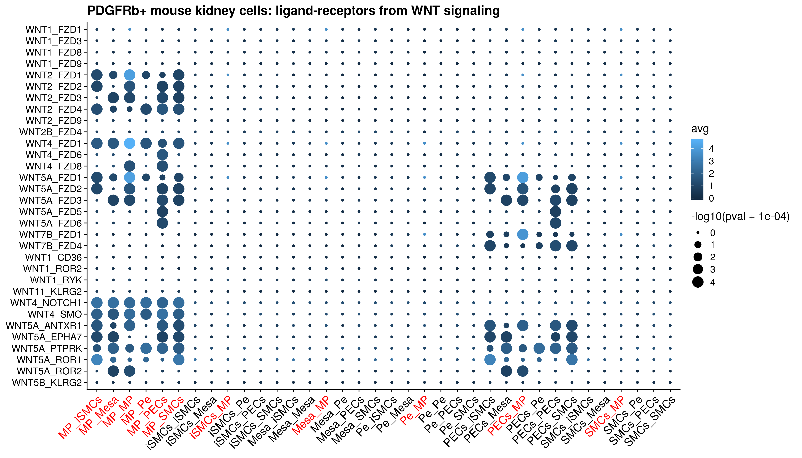

mouse PDGFRb+: Run CPDB focused on WNT ligand-receptor pairs
================
Javier Perales-Paton - <javier.perales@bioquant.uni-heidelberg.de>

## Setting the environment

### Internal variables

``` r
set.seed(1234)
OUTDIR <- "./mouse_PDGFRBpositive_02_CPDB_WNT_output/";
if(!dir.exists(OUTDIR)) dir.create(OUTDIR, recursive = TRUE);

# Please change it to your local installation of CellPhoneDB
CPDB_DIR <- "~/.cpdb/releases/v2.0.0/"
```

### Load libraries

``` r
library(Matrix)
library(SingleCellExperiment)
library(scran)
library(scater)
```

## Load data

``` r
sce <- readRDS("./mouse_PDGFRBpositive_01_create_sce_output/sce.rds")
is(sce)
```

    ## [1] "SingleCellExperiment"       "RangedSummarizedExperiment"
    ## [3] "SummarizedExperiment"       "Vector"                    
    ## [5] "Annotated"                  "vector_OR_Vector"

``` r
dim(sce)
```

    ## [1] 14259   952

## Extract information and map genes onto human

``` r
# Load the ortholog dictionary
mmu2hsa.dic <- readRDS("./00_get_ortohologs_output/mmu2hsa.rds")
```

``` r
# take raw data and normalise it for the subset of cells
count_norm <- logcounts(sce)

meta_data <- data.frame("Cell"=rownames(colData(sce)),
                        "cell_type"=colData(sce)$Annotation.Level.2)

# Transform gene
mmu_genes <- rownames(count_norm)
hsa_genes <- unlist(sapply(mmu_genes, function(g) {
                  if(g %in% names(mmu2hsa.dic)) {
                    mmu2hsa.dic[[g]]
                  } else {
                    NA
                  }
                }))
mmu_genes.rpl <- unlist(sapply(mmu_genes, function(g) {
                if(g %in% names(mmu2hsa.dic)) {
                  rep(g, length(mmu2hsa.dic[[g]]))
                } else {
                  NA
                }
              }))
# Remove  NA's
hsa_genes <- hsa_genes[!is.na(mmu_genes.rpl)]
mmu_genes.rpl <- mmu_genes.rpl[!is.na(mmu_genes.rpl)]

# Reformat matrix
count_norm2 <- count_norm[mmu_genes.rpl, ]
rownames(count_norm2) <- hsa_genes
count_norm2 <- as.matrix(count_norm2)
rm(count_norm)
```

## Save CPDB for WNT signaling

``` r
if(!file.exists(paste0(OUTDIR,"/cellphonedb_count.txt"))) {
write.table(count_norm2, paste0(OUTDIR,"/cellphonedb_count.txt"), sep="\t", quote=F, col.names=NA)
}

if(!file.exists(paste0(OUTDIR,"/cellphonedb_meta.txt"))) {
write.table(meta_data, paste0(OUTDIR,"/cellphonedb_meta.txt"), sep="\t", quote=F, row.names=F)
}
if(!file.exists(paste0(OUTDIR,"/PBS_CellPhoneDB.sh"))) {
file.copy(from = "../templates/PBS_CellPhoneDB.sh",
      to = paste0(OUTDIR,"/PBS_CellPhoneDB.sh"))
}
```

## Run CPDB

``` r
cmd <- paste0("qsub ",paste0(OUTDIR,"/PBS_CellPhoneDB.sh"))
if(!dir.exists(paste0(OUTDIR,"/out"))) {
    system(cmd) # To be shuttled in the HPC
}
```

## Search for WNT pairs in CPDB

``` r
# Find original files of the database
cpdb_fls <- list.files(CPDB_DIR, pattern="\\.csv", full.names = TRUE)
names(cpdb_fls) <- paste0("CPDB.",gsub("_input\\.csv$","",basename(cpdb_fls)))

for(i in names(cpdb_fls)) {
    tmp <- read.table(cpdb_fls[i], sep=",", header=TRUE, stringsAsFactors = FALSE)
    assign(i, tmp)
}

# Which tables have been loaded?
ls(pattern="CPDB\\.")
```

    ## [1] "CPDB.complex"     "CPDB.gene"        "CPDB.interaction"
    ## [4] "CPDB.protein"

Ligand and receptors of WNT pathway are characterized by: \* Ligands
start with `^WNT`. \* Cannonical Receptors start with `FZD`. \* This are
enlisted in one curated review (PMID: ) from CPDB.

Please note that we transform mouse genes to orthologs in human before
running CPDB, so we could just work on human genome since then.

``` r
cat("Ligands:","\t",
        grep("^WNT", CPDB.gene$hgnc_symbol, value=TRUE),"\n",
file=stdout())
```

    ## Ligands:      WNT1 WNT11 WNT2 WNT2B WNT3 WNT3 WNT3 WNT3A WNT4 WNT5A WNT5B WNT7A WNT7B

``` r
cat("Cannonical Receptors:","\t",
        grep("^FZD", CPDB.gene$hgnc_symbol, value=TRUE),"\n",
file=stdout())
```

    ## Cannonical Receptors:     FZD1 FZD10 FZD2 FZD3 FZD4 FZD5 FZD6 FZD7 FZD8 FZD9

The database is subset for members of the WNT pathway.

``` r
CPDB.gene <- CPDB.gene[grep("^(WNT|FZD)[0-9]+",CPDB.gene$hgnc_symbol), ]
CPDB.protein <- subset(CPDB.protein, uniprot %in% CPDB.gene$uniprot)
CPDB.interaction <- subset(CPDB.interaction, 
               partner_a %in% CPDB.gene$uniprot | partner_b %in% CPDB.gene$uniprot)
```

We could omit the table of complex because there is no any
ligand-receptor from WNT involved there.

## Load CPDB output using PDGFRb+ cells as input

``` r
pval <- read.table("./mouse_PDGFRBpositive_02_CPDB_WNT_output/out/pvalues.txt",
           sep="\t",header=TRUE,stringsAsFactors = FALSE, check.names = FALSE)

avg <- read.table("./mouse_PDGFRBpositive_02_CPDB_WNT_output/out/means.txt",
          sep="\t",header=TRUE,stringsAsFactors = FALSE, check.names = FALSE)

### Reformat
rownames(pval) <- pval$id_cp_interaction
rownames(avg) <- avg$id_cp_interaction

### Subset to WNT regulators
WNT.common <- intersect(pval$id_cp_interaction, CPDB.interaction$id_cp_interaction)
pval <- pval[WNT.common, ]
avg <- avg[WNT.common, ]

## Format conversion
df <- pval[,1:11]
pval <- pval[,12:ncol(pval)]
avg <- avg[,12:ncol(avg)]

## Count how many are significant by rows and cols
signif_rows <- rowSums(pval < 0.05) 
signif_cols <- colSums(pval < 0.05) 


stopifnot(all(colnames(pval) == colnames(avg)))
pval2 <- reshape2::melt(as.matrix(pval))
avg2 <- reshape2::melt(as.matrix(avg))

stopifnot(all(pval2[,1] == avg2[,1]))
stopifnot(all(pval2[,2] == avg2[,2]))

dat <- data.frame(id_cp_interaction=pval2[,1],
          cells=pval2[,2],
          pval=pval2[,3],
          avg=avg2[,3])
## Add significance
dat$signif_cnt_interaction <- signif_rows[dat$id_cp_interaction]
dat$signif_cnt_cells <- signif_cols[dat$cells]

# Rename cell populations labels
dat$cells <- as.character(dat$cells)
dat$cells <- gsub("Injured Vascular Smooth Muscle Cells", "iSMCs", dat$cells)
dat$cells <- gsub("Vascular Smooth Muscle Cells", "SMCs", dat$cells)
dat$cells <- gsub("\\(Myo\\)fibroblast", "MP", dat$cells)
dat$cells <- gsub("Mesangial Cells", "Mesa", dat$cells)
dat$cells <- gsub("Parietal Epithelial Cells", "PECs", dat$cells)
dat$cells <- gsub("Pericytes", "Pe", dat$cells)
dat$cells <- gsub("\\|","_", dat$cells)

# Merge with metadata of interacting_pair ligands-receptors
dat <- merge(x=df,y=dat,by.x="id_cp_interaction",by.y="id_cp_interaction",all=TRUE)

# Same ligand-receptors pairs are reverted... this is annoying
idxs <- grep("_WNT.*$",dat$interacting_pair)
idxs2 <- which(dat$receptor_a == "True" & dat$secreted == "True")
stopifnot(all(idxs==idxs2))
for(idx in idxs) {
    dat[idx, "cells"] <- paste(rev(strsplit(dat[idx,"cells"],split="_")[[1]]),collapse="_") 
    dat[idx, "interacting_pair"] <- paste(rev(strsplit(dat[idx,"interacting_pair"],split="_")[[1]]),collapse="_")   
}

# Define factors
# Cells
cells_unique <- sort(unique(dat$cells))
cells_levels <- c(grep("^MP",cells_unique,value=TRUE),
          grep("^MP",cells_unique,value=TRUE, invert=TRUE))
dat$cells <- factor(dat$cells, levels=cells_levels)
# Ligand-receptors
pairs_unique <- sort(unique(dat$interacting_pair), decreasing=FALSE)
pairs_levels <- c(grep("^WNT.*FZD.*$",pairs_unique,value=TRUE),
          grep("^WNT.*FZD.*$",pairs_unique,value=TRUE, invert=TRUE))
dat$interacting_pair <- factor(dat$interacting_pair, levels=rev(pairs_levels))
```

``` r
# Source: https://rdrr.io/bioc/enrichplot/src/R/dotplot.R
ggplot(dat, aes(x=cells, y=interacting_pair, size=-log10(pval+1e-4), color=avg)) +
        geom_point() + 
    ggtitle("PDGFRb+ mouse kidney cells: ligand-receptors from WNT signaling") +
    cowplot::theme_cowplot() + 
    theme(axis.text.x = element_text(angle = 45, hjust = 1,
                     size=14,
                     colour=ifelse(grepl("MP", levels(dat$cells)),
                                 "red","black")),
          axis.title = element_blank()
    )
```

<!-- -->

``` r
ggplot(subset(dat, signif_cnt_interaction > 0 & signif_cnt_cells > 0), 
       aes(x=cells, y=interacting_pair, size=-log10(pval+1e-4), color=avg)) +
        geom_point() + 
    ggtitle("PDGFRb+ mouse kidney cells: ligand-receptors from WNT signaling") +
    cowplot::theme_cowplot() + 
    theme(axis.text.x = element_text(angle = 45, hjust = 1,
                     size=14,
                     colour=ifelse(grepl("MP", levels(dat$cells)),
                                 "red","black")),
          axis.title = element_blank()
    )
```

<!-- -->

## SessionInfo

``` r
sessionInfo()
```

    ## R version 3.6.1 (2019-07-05)
    ## Platform: x86_64-conda_cos6-linux-gnu (64-bit)
    ## Running under: Ubuntu 18.04.3 LTS
    ## 
    ## Matrix products: default
    ## BLAS/LAPACK: /home/jperales/miniconda3/envs/kidfib/lib/R/lib/libRblas.so
    ## 
    ## locale:
    ##  [1] LC_CTYPE=en_US.UTF-8          LC_NUMERIC=en_GB.UTF-8       
    ##  [3] LC_TIME=en_GB.UTF-8           LC_COLLATE=en_US.UTF-8       
    ##  [5] LC_MONETARY=en_GB.UTF-8       LC_MESSAGES=en_US.UTF-8      
    ##  [7] LC_PAPER=en_GB.UTF-8          LC_NAME=en_GB.UTF-8          
    ##  [9] LC_ADDRESS=en_GB.UTF-8        LC_TELEPHONE=en_GB.UTF-8     
    ## [11] LC_MEASUREMENT=en_GB.UTF-8    LC_IDENTIFICATION=en_GB.UTF-8
    ## 
    ## attached base packages:
    ## [1] parallel  stats4    stats     graphics  grDevices utils     datasets 
    ## [8] methods   base     
    ## 
    ## other attached packages:
    ##  [1] rmarkdown_1.12              scater_1.14.0              
    ##  [3] ggplot2_3.1.1               scran_1.14.1               
    ##  [5] SingleCellExperiment_1.8.0  SummarizedExperiment_1.16.0
    ##  [7] DelayedArray_0.12.0         BiocParallel_1.20.0        
    ##  [9] matrixStats_0.56.0          Biobase_2.46.0             
    ## [11] GenomicRanges_1.38.0        GenomeInfoDb_1.22.0        
    ## [13] IRanges_2.20.0              S4Vectors_0.24.0           
    ## [15] BiocGenerics_0.32.0         Matrix_1.2-17              
    ## [17] nvimcom_0.9-82             
    ## 
    ## loaded via a namespace (and not attached):
    ##  [1] Rcpp_1.0.1               rsvd_1.0.2              
    ##  [3] locfit_1.5-9.4           lattice_0.20-38         
    ##  [5] digest_0.6.18            assertthat_0.2.1        
    ##  [7] R6_2.4.0                 plyr_1.8.4              
    ##  [9] evaluate_0.13            pillar_1.3.1            
    ## [11] zlibbioc_1.32.0          rlang_0.3.4             
    ## [13] lazyeval_0.2.2           irlba_2.3.3             
    ## [15] labeling_0.3             BiocNeighbors_1.4.0     
    ## [17] statmod_1.4.34           stringr_1.4.0           
    ## [19] igraph_1.2.4.1           RCurl_1.95-4.12         
    ## [21] munsell_0.5.0            xfun_0.6                
    ## [23] compiler_3.6.1           vipor_0.4.5             
    ## [25] BiocSingular_1.2.0       pkgconfig_2.0.2         
    ## [27] ggbeeswarm_0.6.0         htmltools_0.3.6         
    ## [29] tidyselect_0.2.5         tibble_2.1.1            
    ## [31] gridExtra_2.3            GenomeInfoDbData_1.2.2  
    ## [33] edgeR_3.28.0             viridisLite_0.3.0       
    ## [35] crayon_1.3.4             dplyr_0.8.0.1           
    ## [37] withr_2.1.2              bitops_1.0-6            
    ## [39] grid_3.6.1               gtable_0.3.0            
    ## [41] magrittr_1.5             scales_1.0.0            
    ## [43] dqrng_0.2.1              stringi_1.4.3           
    ## [45] XVector_0.26.0           reshape2_1.4.3          
    ## [47] viridis_0.5.1            limma_3.42.0            
    ## [49] DelayedMatrixStats_1.8.0 cowplot_1.0.0           
    ## [51] tools_3.6.1              glue_1.3.1              
    ## [53] beeswarm_0.2.3           purrr_0.3.2             
    ## [55] yaml_2.2.0               colorspace_1.4-1        
    ## [57] knitr_1.22

``` r
{                                                                                                                                                                                                           
sink(file=paste0(OUTDIR,"/sessionInfo.txt"))
print(sessionInfo())
sink()
}
```
